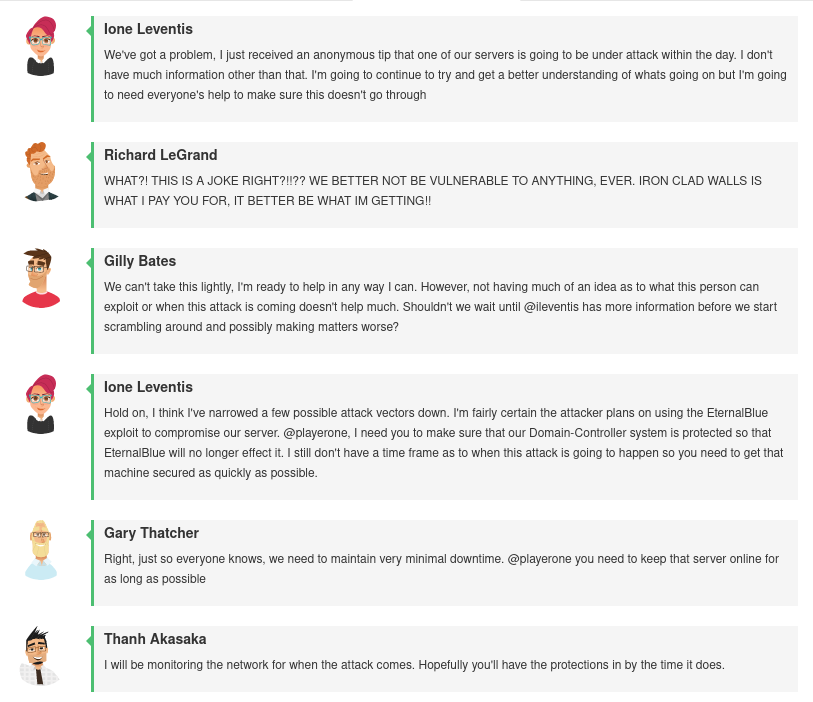

# Challenge 02 (#T0175) - Preventative Protection: Thwarting the Imminent Threat

## Challenge Info
**Author:** Alexander Hillock<br>
**Framework Category:** Protect and Defend<br>
**Specialty Area:** Incident Response<br>
**Work Role:** Cyber Defense Incident Responder<br>
**Task Description:** Perform real-time cyber defense incident handling (e.g., forensic collections, intrusion correlation and tracking, threat analysis, and direct system remediation) tasks to support deployable Incident Response Teams (IRTs).

### Scenario
We have received an anonymous tip that one of our systems are under imminent threat from an outside attack. Your job is to put into place proper defenses before the attack is successfully completed and our system is compromised.

### Additional Information
More details and objectives about this challenge will be introduced during the challenge meeting, which will start once you begin deploying the challenge.

You will be able to check your progress during this challenge using the check panel within the workspace once the challenge is deployed. The checks within the check panel report on the state of some or all of the required tasks within the challenge.

Once you have completed the requested tasks, you will need to document the methodology you used with as much detail and professionalism as necessary. This should be done on the documentation tab within the workspace once the challenge is deployed. Below the main documentation section be sure to include a tagged list of applications you used to complete the challenge.

Your username/password to access all virtual machines and services within the workspace will be the following...

Username: `playerone`<br>
Password: `password123`

This challenge contains time sensitive checks. When attempting challenges with time sensitive checks, we recommend that players set aside dedicated and uninterrupted time to complete them. Once the checks with a "Check Type" labeled "One-Time" display anything other than an "Unchecked" state, they can no longer be changed. If players are not satisfied with the final state of a one-time check, the challenge must be redeployed in order to try again.

Should you fail to implement proper mitigations against the attack in time, the attack present in this challenge will sometimes, but not always, cause numerous disruptive actions ending in the Domain-Controller being shut down. Regardless of the attack being disruptive or not, failure to implement proper mitigations against the attack will result in an Objective Incomplete state for the check labeled "Attack Thwarted."

## Meeting Notes


## Network Map


## Documentation
Meeting notes indicated that the EternalBlue exploit ([CVE-2017-0144](https://www.cve.org/CVERecord?id=CVE-2017-0144)) would likely be used to attack the domain controller (`172.16.30.5`). This exploit is detailed in [Microsoft's Security Bulletin MS17-010](https://docs.microsoft.com/en-us/security-updates/SecurityBulletins/2017/ms17-010) as a Windows Server Message Block (SMB) remote code execution vulnerability that affects SMBv1.

Additional information about EternalBlue:
- https://en.wikipedia.org/wiki/EternalBlue
- https://www.hypr.com/eternalblue/


Microsoft had related security patches to address this vulnerability, however updates failed to execute on the domain controller; the security patch could not be applied.


As a workaround to defend against exploitation, the following commands were ran in an admin-elevated PowerShell terminal to:

1. Disable SMBv1 server services.
2. Disable SMBv1 client services.


```powershell
Get-SmbServerConfiguration | Select EnableSMB1Protocol
Set-SmbServerConfiguration -EnableSMB1Protocol $false

sc.exe qc lanmanworkstation
sc.exe config lanmanworkstation depend= bowser/mrxsmb20/nsi
sc.exe config mrxsmb10 start= disabled
```

The above commands are referenced from Microsoft's documentation:
https://docs.microsoft.com/en-us/windows-server/storage/file-server/troubleshoot/detect-enable-and-disable-smbv1-v2-v3

Disabling SMBv1 services resulted in successful mitigating against the attempted EternalBlue exploit.

## NICE Framework & CAE KU Mapping

### NICE Framework KSA
- K0004. Knowledge of cybersecurity and privacy principles.
- K0005. Knowledge of cyber threats and vulnerabilities.
- K0070. Knowledge of system and application security threats and vulnerabilities (e.g., buffer overflow, mobile code, cross-site scripting, Procedural Language/Structured Query Language [PL/SQL] and injections, race conditions, covert channel, replay, return-oriented attacks, malicious code).
- K0157. Knowledge of cyber defense and information security policies, procedures, and regulations.
- K0161. Knowledge of different classes of attacks (e.g., passive, active, insider, close-in, distribution attacks).
- K0162. Knowledge of cyber attackers (e.g., script kiddies, insider threat, non-nation state sponsored, and nation sponsored).
- K0167. Knowledge of system administration, network, and operating system hardening techniques.
- S0078. Skill in recognizing and categorizing types of vulnerabilities and associated attacks.

### CAE Knowledge Units
- Cybersecurity Foundations
- Cybersecurity Principles
- Cyber Threats
- Network Defense
- Operating Systems Concepts
- Vulnerability Analysis