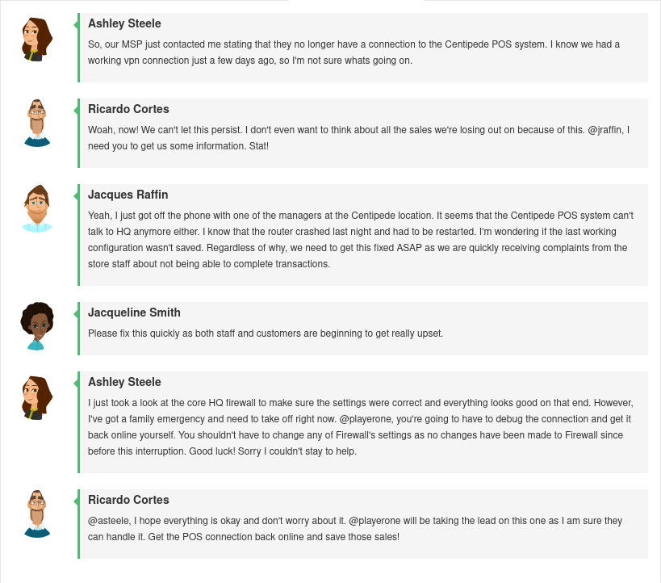
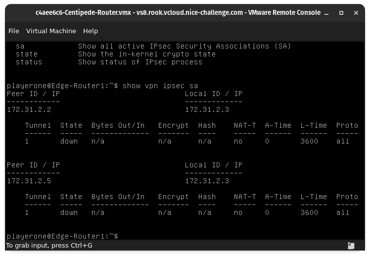

# Challenge 03 (#T0180) - Systems Administrations: Cyber Defense Edition


## Challenge Info
**Author:** Agustin Castro<br>
**Framework Category:** Protect and Defend<br>
**Specialty Area:** Cybersecurity Defense Infrastructure Support<br>
**Work Role:** Cyber Defense Infrastructure Support Specialist<br>
**Task Description:** Perform system administration on specialized cyber defense applications and systems (e.g., antivirus, audit and remediation) or Virtual Private Network (VPN) devices, to include installation, configuration, maintenance, backup, and restoration.

### Scenario
Our managed service provider has notified us that an important system/application is either missing or no longer functioning properly. This has brought the company's current cyber defense posture below an acceptable baseline. Confirm the system/application that the managed service provider has identified with engineering and then correct the issue as soon as possible.

### Additional Information
More details and objectives about this challenge will be introduced during the challenge meeting, which will start once you begin deploying the challenge.

You will be able to check your progress during this challenge using the check panel within the workspace once the challenge is deployed. The checks within the check panel report on the state of some or all the required tasks within the challenge.

Once you have completed the requested tasks, you will need to document the methodology you used with as much detail and professionalism as necessary. This should be done on the documentation tab within the workspace once the challenge is deployed. Below the main documentation section be sure to include a tagged listed of applications you used to complete the challenge.

Your username/password to access all virtual machines and services within the workspace will be the following...<br>
Username: `playerone`<br>
Password: `password123`

The username/password used to access the Firewall's web interface within the workspace will be the following...<br>
Username: `admin`<br>
Password: `password123`

## Meeting Notes


## Network Map


## Documentation
remote into  Security desk
Login to pfSense firewall (https://172.31.2.2)

IPsec VPN config found in firewall.
Based on Network Map, Edge-Router1 (Centipede) is 172.31.2.3
Mode: main
P1 Protocol: AES-256
P1 transforms: SHA1
P1 DH-group: 5
P1 description: POS1
P2 mode: tunnel
P2: local subnet 172.16.30.0/24
remote subnet: 192.168.10.0/24
P2 protocol: ESP
P2 transforms: AES-256, 3DES
P2 auth method: MD5,SHA1

https://docs.vyos.io/en/equuleus/
remote into VyOS router
https://docs.vyos.io/en/equuleus/configuration/vpn/site2site_ipsec.html
`$ show interfaces`

```
eth0  172.31.2.3/24
eth1  192.168.10.254/24
lo    127.0.0.1/8
      ::1/128
```

`$ show vpn ipsec status`

```
IPsec Interfaces :
        eth0  (172.31.2.3)
```

`$ show vpn ipsec sa`



`$ monitor vpn ipsec`

```
  VPN-IPSEC: "peer-172.31.2.2-tunnel-1" #47: ignoring informational payload, type INVALID_HASH_INFORMATION
  VPN-IPSEC: "peer-172.31.2.2-tunnel-1" #61: max number of retransmissions (2) reached STATE_QUICK_I1. No acceptable response to our first Quick Mode message: perhaps peer likes no proposal
  VPN-IPSEC: "peer-172.31.2.5-tunnel-1" #55: cannot respond to IPsec SA request because no connection is known for 192.168.10.0/24===172.31.2.3[172.31.2.3]...172.31.2.5[172.31.2.5]
```

```
$ config
# 
```

## NICE Framework & CAE KU Mapping
### NICE Framework KSA
* K0001. Knowledge of computer networking concepts and protocols, and network security methodologies.
* K0004. Knowledge of cybersecurity and privacy principles.
* K0005. Knowledge of cyber threats and vulnerabilities.
* K0033. Knowledge of host/network access control mechanisms (e.g., access control list, capabilities lists).
* K0044. Knowledge of cybersecurity and privacy principles and organizational requirements (relevant to confidentiality, integrity, availability, authentication, non-repudiation).
* K0104. Knowledge of Virtual Private Network (VPN) security.
* K0221. Knowledge of OSI model and underlying network protocols (e.g., TCP/IP).
* K0332. Knowledge of network protocols such as TCP/IP, Dynamic Host Configuration, Domain Name System (DNS), and directory services.
* K0334. Knowledge of network traffic analysis (tools, methodologies, processes).
* S0059. Skill in using Virtual Private Network (VPN) devices and encryption.
* S0077. Skill in securing network communications.
* S0121. Skill in system, network, and OS hardening techniques. (e.g., remove unnecessary services, password policies, network segmentation, enable logging, least privilege, etc.).

### CAE Knowledge Units
* Advanced Network Technology and Protocols
* Basic Networking
* Cybersecurity Foundations
* Cybersecurity Principles
* Network Defense
* Operating Systems Administration
* Operating Systems Concepts
