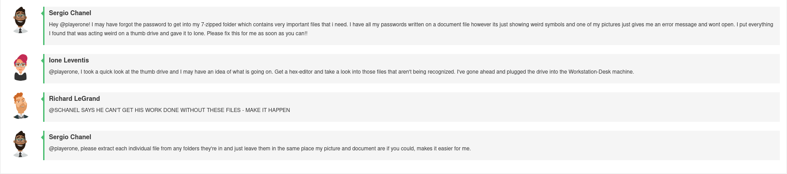
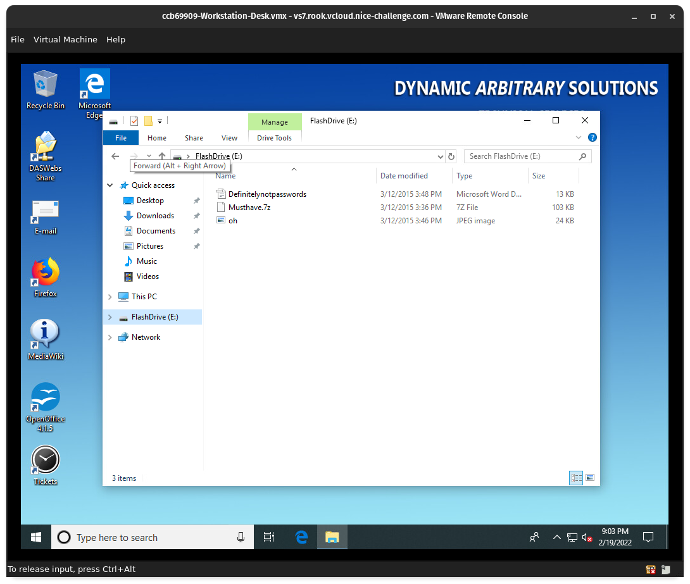
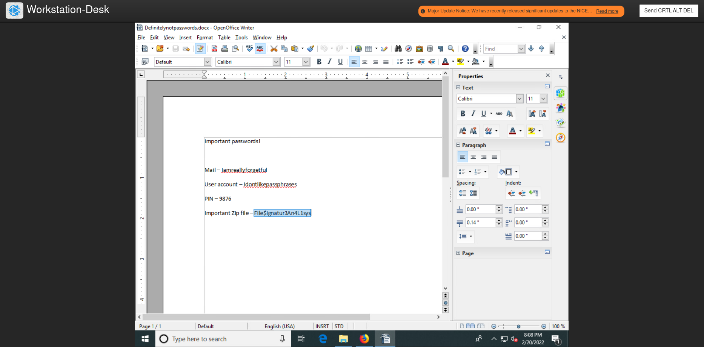
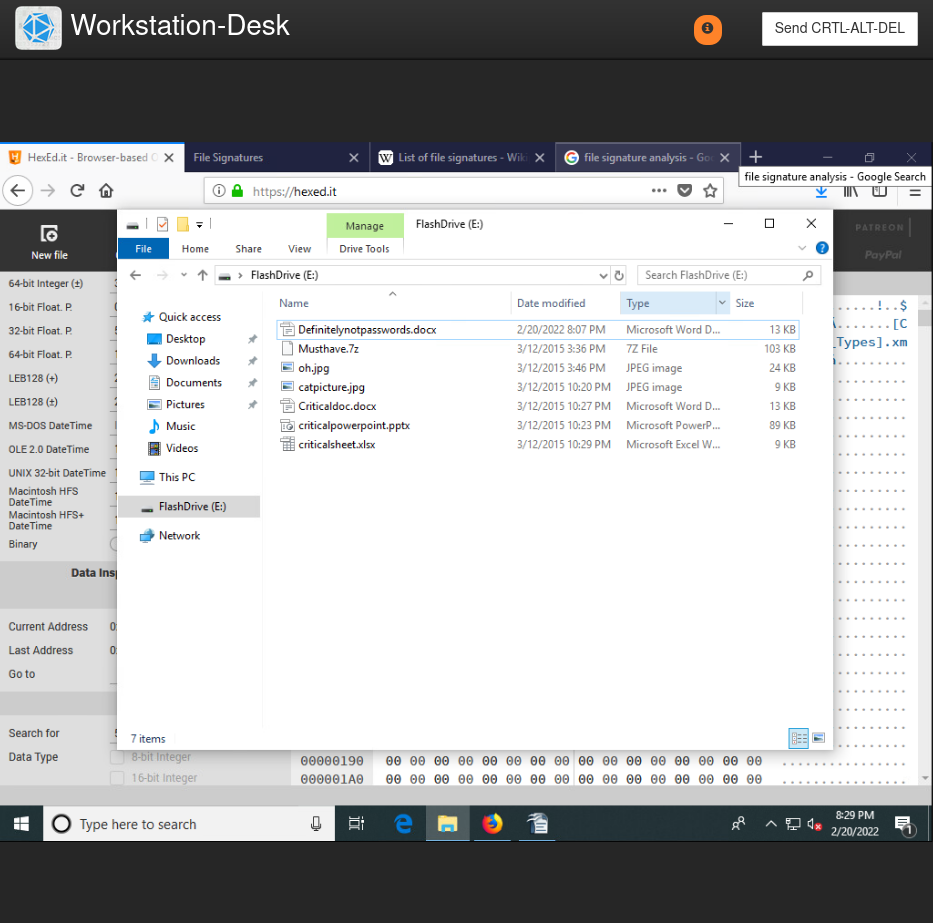

# Challenge 04 (#T0167) - File Signatures Broke My Files

## Challenge Info
**Author:** Alexander Hillock 
**Framework Category:** Investigate 
**Specialty Area:** Digital Forensics 
**Work Role:** Law Enforcement/Counter Intelligence Forensics 
**Task Description** Perform file signature analysis.

### Scenario
Sergio is complaining that some of his files are broken and he can't figure out why. According to him, critical files are stored within a zip which seems to be stopping him from performing his job. Unfortunately, he has forgot the password to that zip, and the document he stores it in is broken. I need you to find a fix for the file that has the password used to unlock the zipped folder and get him access to what he needs.

### Additional Information
More details and objectives about this challenge will be introduced during the challenge meeting, which will start once you begin deploying the challenge.

You will be able to check your progress during this challenge using the check panel within the workspace once the challenge is deployed. The checks within the check panel report on the state of some or all of the required tasks within the challenge.

Once you have completed the requested tasks, you will need to document the methodology you used with as much detail and professionalism as necessary. This should be done on the documentation tab within the workspace once the challenge is deployed. Below the main documentation section be sure to include a tagged list of applications you used to complete the challenge.

Your username/password to access all virtual machines and services within the workspace will be the following... 
Username: `playerone` 
Password: `password123`

The username/password used to access the Firewall's web interface within the workspace will be the following... 
Username: `admin` 
Password: `password123`

## Meeting Notes

## Network Map

## Documentation
On the `Workstation-Desk` machine, there was an `E:\` drive that contained three files:

1. `Definitelynotpasswords.docx`
2. `Musthave.7z`
3. `oh.jpg`

As described in the meeting notes, the data in the `.docx` file was corrupted; opening the file only showed random data that was not readable.

To begin fixing the issue with the `.docx` file, I used the hex editor website **[HexEd.it](https://hexed.it)** and opened the file with the tool.

Cross-referencing information found on [this website](https://www.garykessler.net/library/file_sigs.html), I began looking for the following byte data in the `.docx` file:

- `50 4B 03 04` - data at the beginning of the file.
- `50 4B 05 06` - trailer data--followed by 18 additional bytes at the end of the file.

The latter data (`50 4B 05 06`) was present in the file, but the former data (`50 4B 03 04`) was missing. I fixed this by inserting four additional bytes at the beginning of the file and filling those bytes with `50 4B 03 04`.

I then exported the resulting data into a new `Definitelynotpasswords.docx` file, and this time, the file opened with readable information.

With the password to the `Musthave.7z` compressed archive, I unzipped the contents of the `.7z` file, and I was able to successfully retrieve the critical data.

## NICE Framework & CAE KU Mapping

### NICE Framework KSA

* K0060. Knowledge of operating systems.
* K0304. Knowledge of concepts and practices of processing digital forensic data.
* S0073. Skill in using virtual machines. (e.g., Microsoft Hyper-V, VMWare vSphere, Citrix XenDesktop/Server, Amazon Elastic Compute Cloud, etc.).
* S0088. Skill in using binary analysis tools (e.g., Hexedit, command code xxd, hexdump).

### CAE Knowledge Units

* Digital Forensics
* Host Forensics
* IT Systems Components