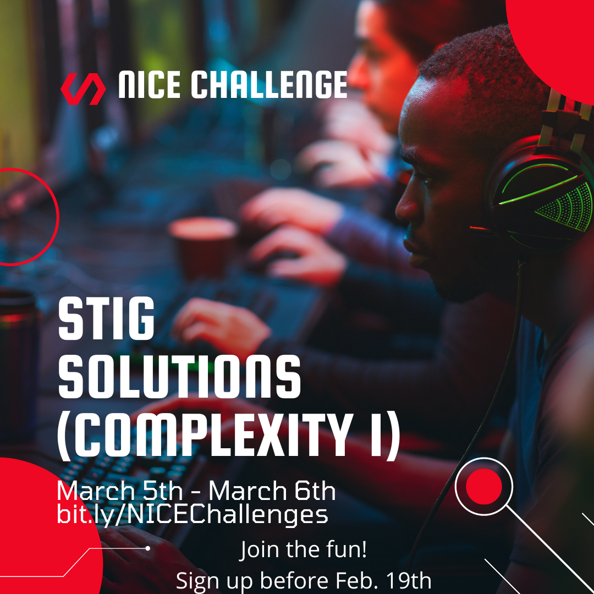
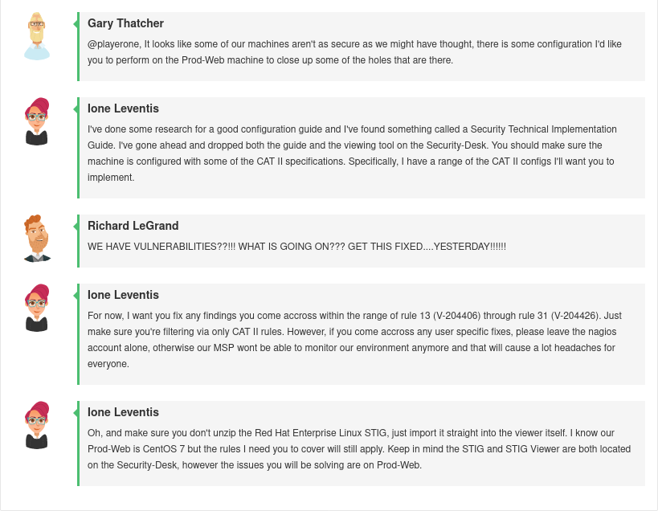
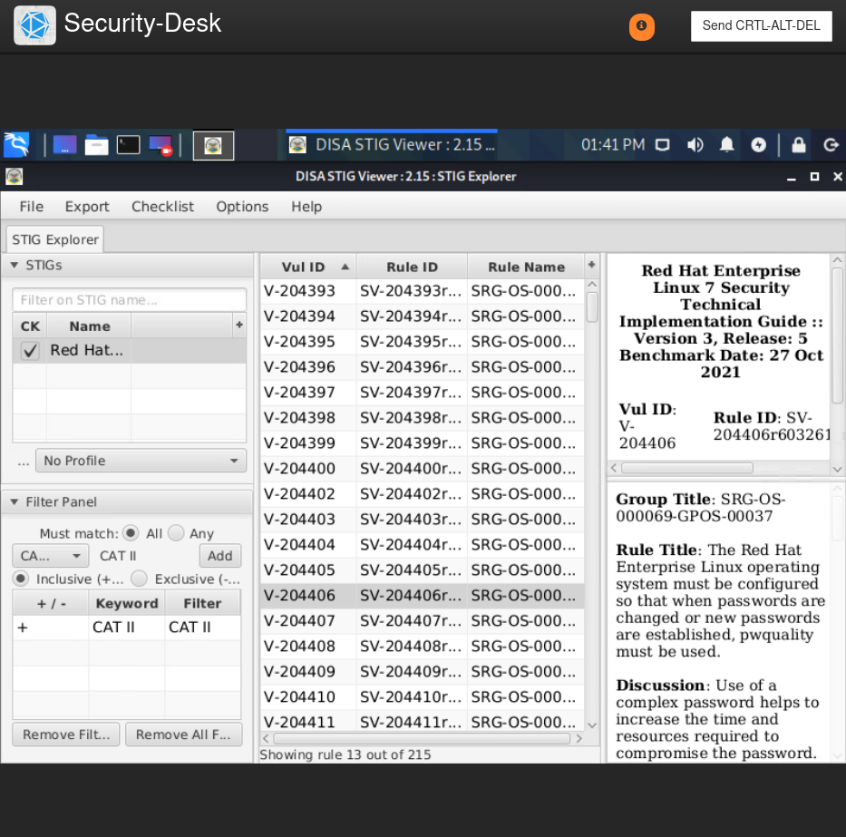
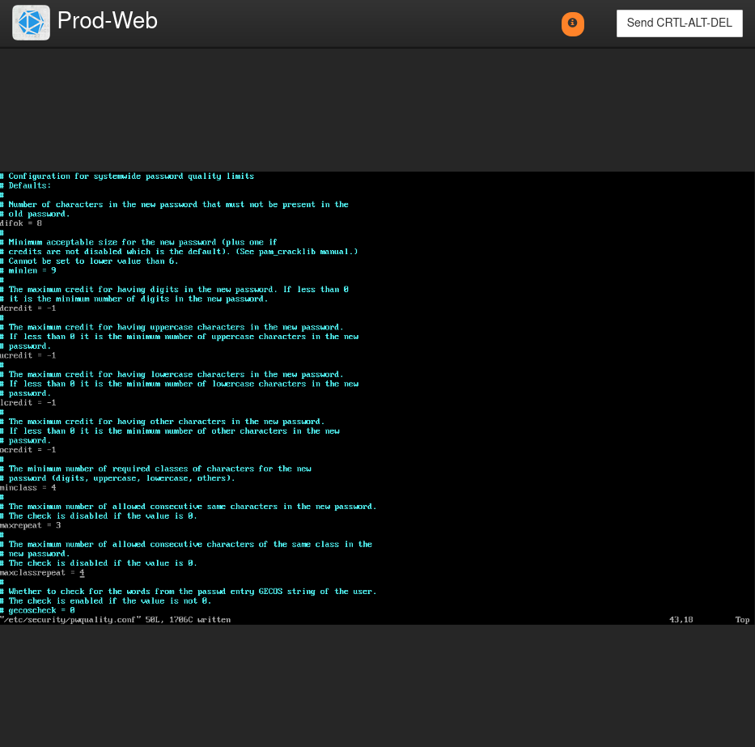

# Challenge 05 (T0485) - STIG Solutions (Complexity 1)

## Challenge Info
**Author:** Alexander Hillock 
**Framework Category:** Operate and Maintain 
**Specialty Area:** Systems Analysis 
**Work Role:** Systems Security Analyst 
**Task Description:** Implement security measures to resolve vulnerabilities, mitigate risks, and recommend security changes to system or system components as needed. 

### Scenario
After a review, I was made aware that some of our computers are not up to security configuration standards, leaving the machines open to multiple vulnerabilities that could be catastrophic if exploited. I need you to configure specific machines to comply with specific configurations found in DISA's (Defense Information Systems Agency) Security Technical Implementation Guide.

### Additional Information
More details and objectives about this challenge will be introduced during the challenge meeting, which will start once you begin deploying the challenge.

You will be able to check your progress during this challenge using the check panel within the workspace once the challenge is deployed. The checks within the check panel report on the state of some or all of the required tasks within the challenge.

Once you have completed the requested tasks, you will need to document the methodology you used with as much detail and professionalism as necessary. This should be done on the documentation tab within the workspace once the challenge is deployed. Below the main documentation section be sure to include a tagged list of applications you used to complete the challenge.

You username/password to access all virtual machines and services within the workspace will be the following... 
Username: `playerone` 
Password: `password123`

The username/password used to access the Firewall's web interface within the workspace will be the following... 
Username: `admin` 
Password: `password123`

## Meeting Notes

## Network Map

## Documentation
As discussed in the Meeting Notes, the `Prod-Web` CentOS machine improperly secured and does not meet specific security configuration standards that are outlined in the [*Red Hat Enterprise Linux 7 Security Technical Implementation Guide (STIG)*](https://stigviewer.com/stig/red_hat_enterprise_linux_7/2021-12-02/). These deficiencies are only limited to *CAT II* severity--and are the following Finding IDs: `V-204406` - `V-204426`.

To begin remediating this issue, I accessed the `Security-Desk` workstation, opened the DISA STIG Viewer application, and loaded the `U_RHEL_7_V3R5_STIG.zip` file--which contains the Red Hat Enterprise Linux STIG.

By following the STIG's guidance on checking and remediating any findings present on `Prod-Web`, I was able properly configure the CentOS server to meet reasonable security standards.

### Applications Used
- Kali Linux
- vim
- Firefox
- grep
- awk
- CentOS
- DISA STIG Viewer

## NICE Framework & CAE KU Mapping
T0485 Implement security measures to resolve vulnerabilities, mitigate risks, and recommend security changes to system or system components as needed.

### NICE Framework KSA
- K0004 Knowledge of cybersecurity and privacy principles.
- K0005 Knowledge of cyber threats and vulnerabilities.
- K0036 Knowledge of human-computer interaction principles.
- K0040 Knowledge of vulnerability information dissemination sources (e.g., alerts, advisories, errata,
and bulletins).
- K0044 Knowledge of cybersecurity and privacy principles and organizational requirements (relevant to confidentiality, integrity, availability, authentication, non-repudiation).
- K0060 Knowledge of operating systems.
- K0275 Knowledge of configuration management techniques.
- K0276 Knowledge of security management.
- K0297 Knowledge of countermeasure design for identified security risks.
- S0001 Skill in conducting vulnerability scans and recognizing vulnerabilities in security systems

### CAE Knowledge Units
- Cybersecurity Foundations
- Cybersecurity Planning and Management
- IA Compliance
- IA Standards
- Operating Systems Administration
- Operating Systems Concepts
- Vulnerability Analysis
