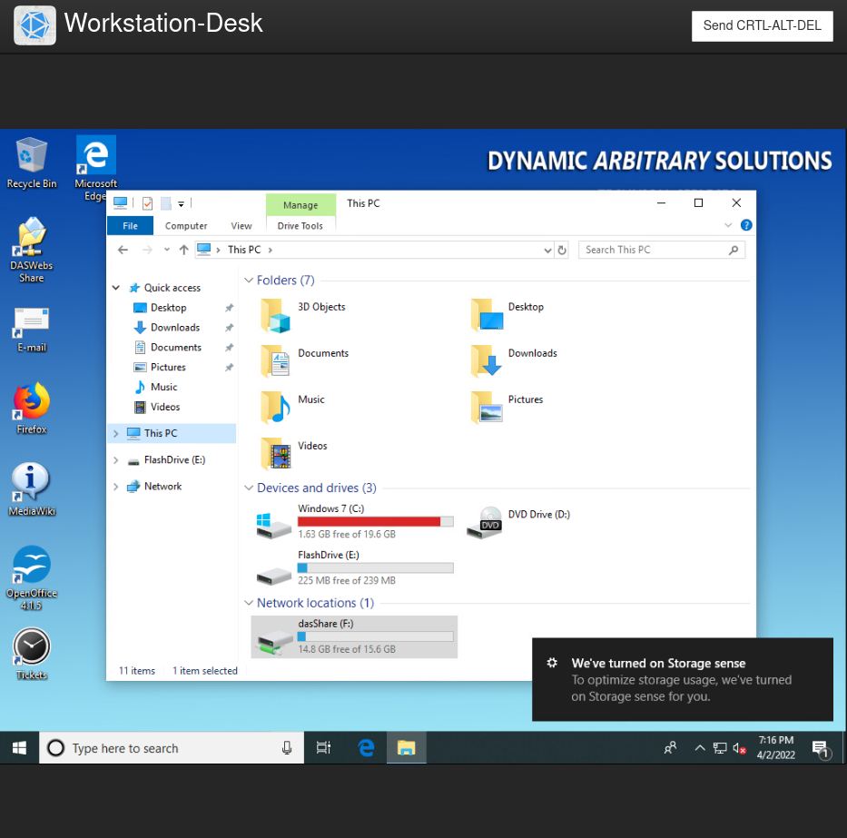
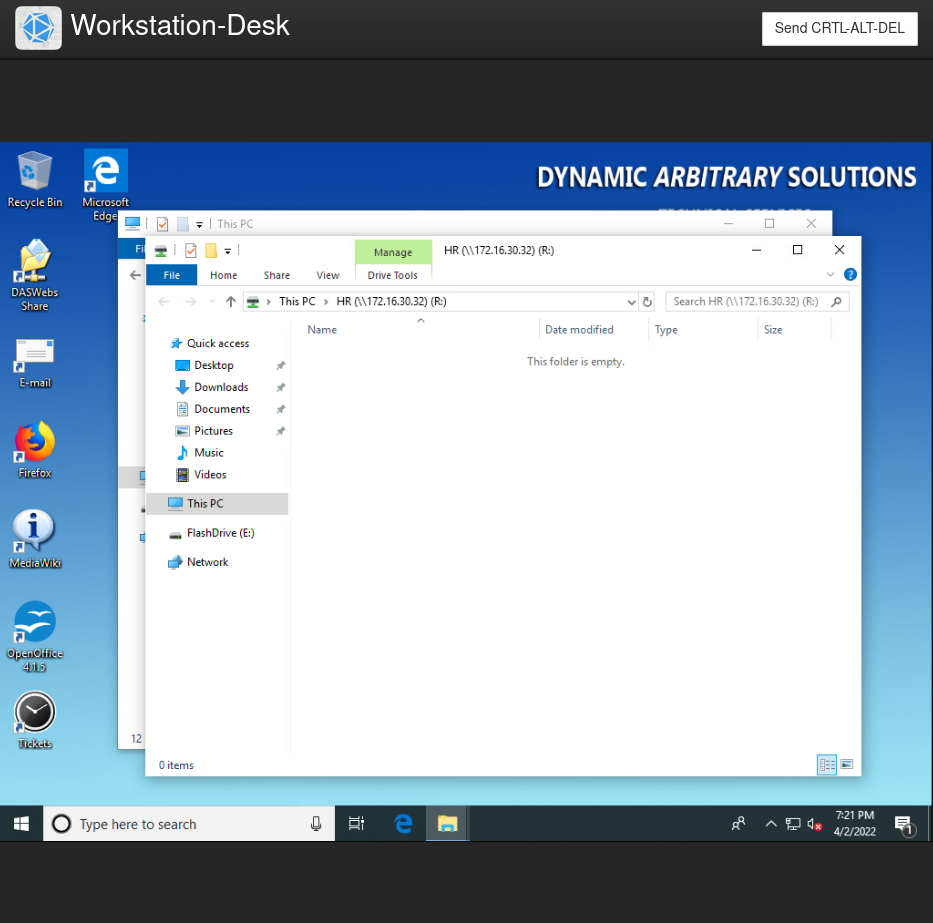
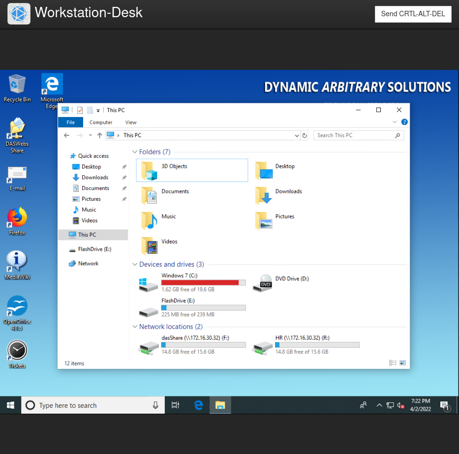
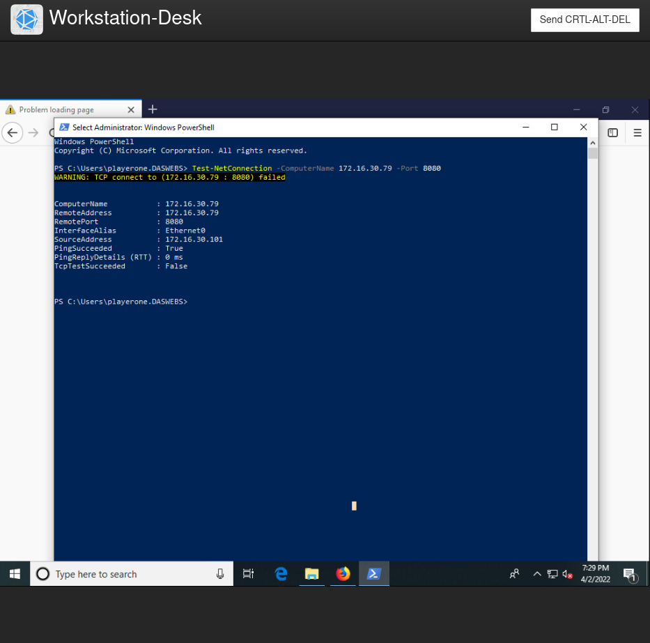
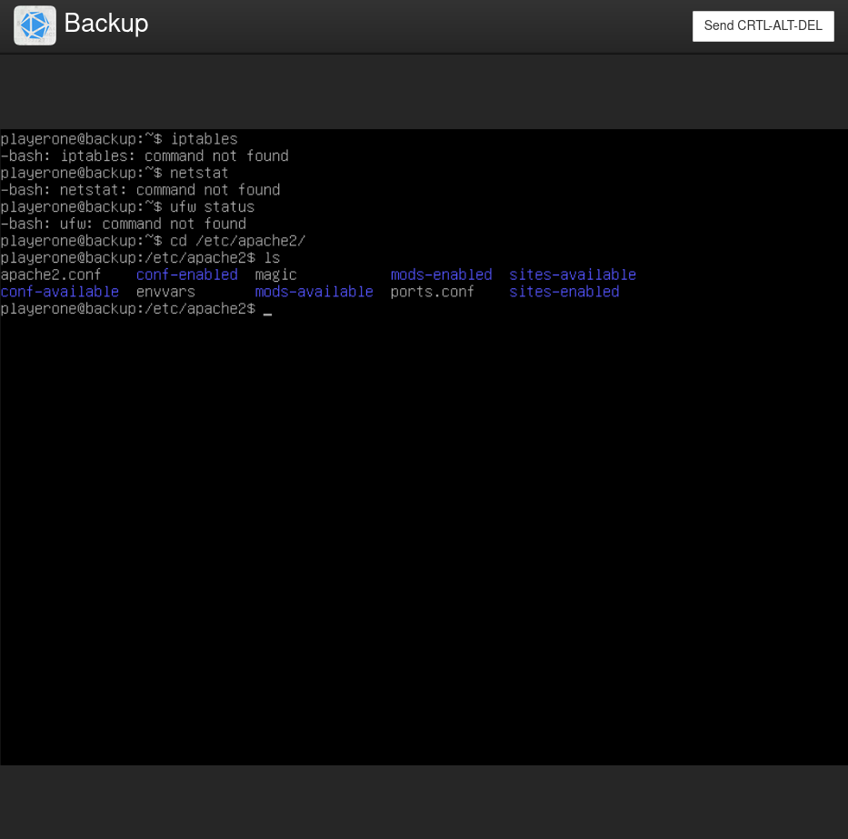
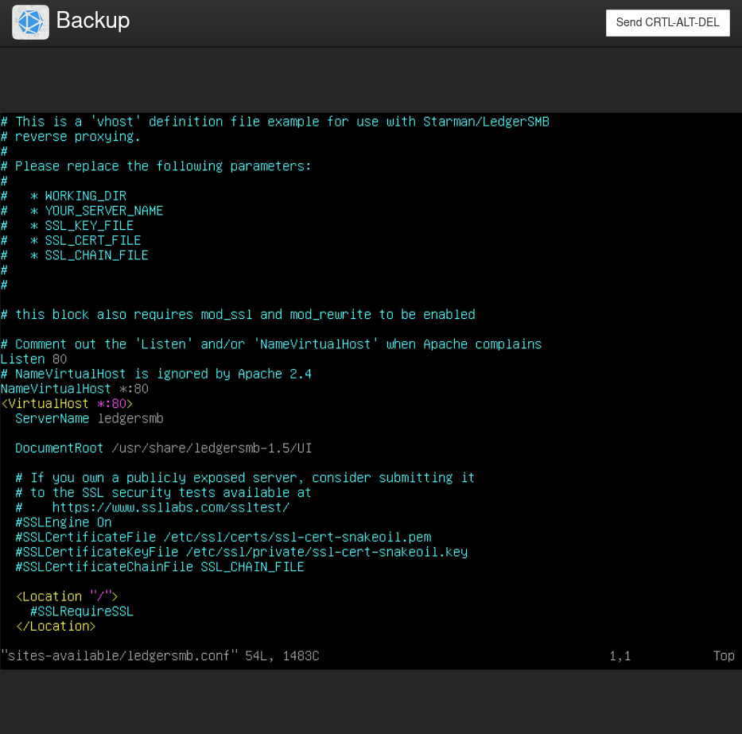
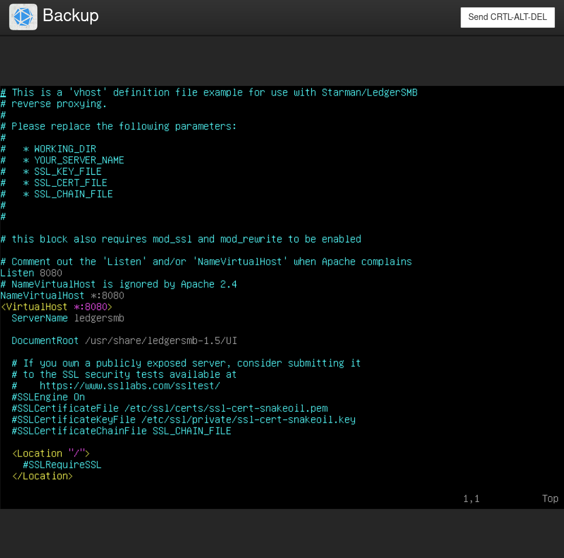
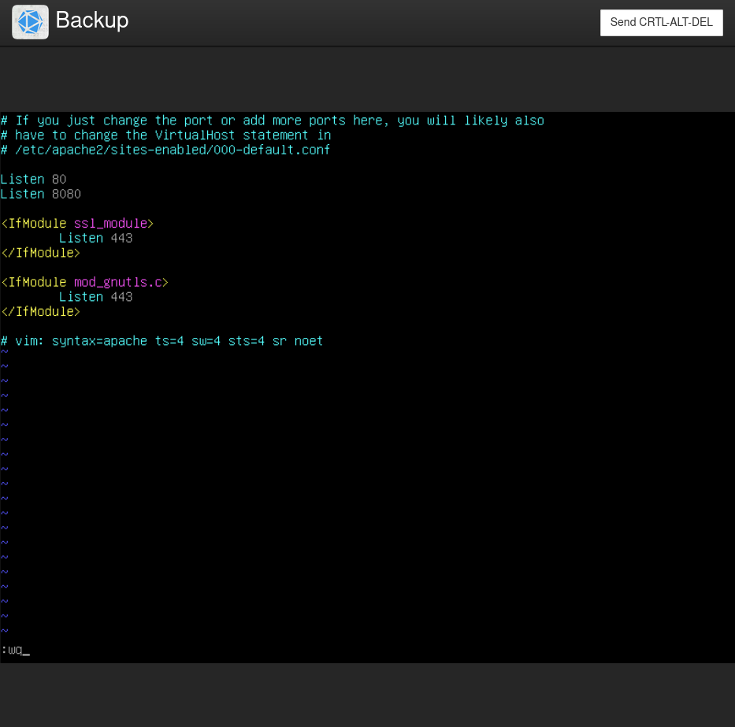
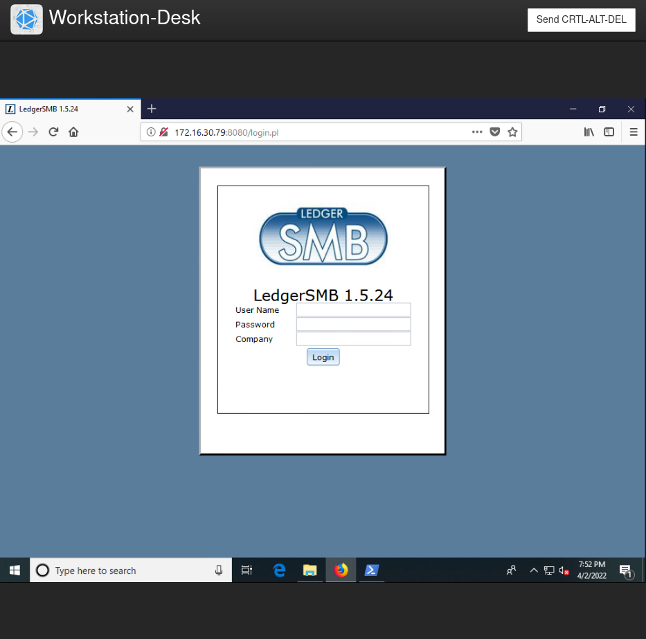

# Challenge 07 (T0237) - Helpdesk Fun: Disappearing Drives & Web Apps

## Challenge Info
**Author:** Jeff Echlin<br>
**Framework Category:** Operate and Maintain<br>
**Specialty Area:** Customer Service and Technical Support<br>
**Work Role:** Technical Support Specialist<br>
**Task Description:** Troubleshoot system hardware and software.

### Scenario
You have been busy as DAS Webs Inc.'s new help desk personnel. Today, you have been assigned two troubleshooting issues:

1. Sergio Chanel recently put in a requisition for a new small internal hard drive so he could store any intermediate employee performance reports and other performance data before they are committed to the company HR file share. He requested that this drive be mapped with a drive letter of R. He reports that the drive worked initially but became slow. He explained that he "fiddled" with some settings in the hope that he could fix the general sluggishness. He was hoping that he would be able to avoid asking for help, but now, for some reason, the drive no longer shows up at all. Help him fix this issue.
2. Sergio Chanel needs to change some contact information for an employee that just moved to a satellite branch of DAS Webs. Sergio tried to log into Ledger SMB to record the changes. However, when navigating to the LedgerSMB web page he reported an error. Please restore functionality to LedgerSMB again.

### Additional Information
More details and objectives about this challenge will be introduced during the challenge meeting, which will start once you begin deploying the challenge.

You will be able to check your progress during this challenge using the check panel within the workspace once the challenge is deployed. The checks within the check panel report on the state of some or all of the required tasks within the challenge.

Once you have completed the requested tasks, you will need to document the methodology you used with as much detail and professionalism as necessary. This should be done on the documentation tab within the workspace once the challenge is deployed. Below the main documentation section be sure to include a tagged list of applications you used to complete the challenge.

Your username/password to access all virtual machines and services within the workspace will be the following...<br>
Username: `playerone`<br>
Password: `password123`

The username/password used to access the Firewall's web interface within the workspace will be the following...<br>
Username: `admin`<br>
Password: `password123`

## Meeting Notes


## Network Map


## Documentation
I first started working on the `R:` drive mapping issue. Based on the meeting notes and the challenge information, I figured that the file share `HR` was located on the `FileShare` host at the IP address `172.16.30.32`. Using this information, I logged into the `Workstation-Desk` computer and attempted to map the file share path `\\172.16.30.32\HR` to the `R:` drive, and this was successful.







The steps I used to map a network drive on the computer can be found at this link: 

To begin working on the next issue, I opened up PowerShell--while still logged into `Workstation-Desk`--and ran the following cmdlet:

```
Test-NetConnection -ComputerName 172.16.30.79 -Port 8080
```

The `Test-NetConnection` cmdlet displays diagnostic information for a particular connection. The parameters I used, `-ComputerName` and `-Port`, are used to specify the specific computer target and TCP port to test against.



Based on the output that came back, the `Backup` server was reachable via ICMP packets, but it was not reachable over TCP 8080. My first thought was that perhaps the server's host-based firewall may be blocking the traffic.

To investigate further, I logged into the `Backup` server. The server ran on the Debian operating system.

I tried various commands to see if I could configure the firewall on the servers, such as `iptables`, `netstat`, and `ufw`, but the server did not seem to have these tools availble. However, I did notice that the server run Apache as its web hosting application.



I also noticed that there was a site config file for the LedgerSMB website at `/etc/apache2/sites-available/ledgersmb.conf`.



I modified the config file to so that the site would instead listen on Port 8080.



I also, for good measure, modified the `/etc/apache2/ports.conf` file to include `Listen 8080`. I'm not quite sure if this configuration was necessary though.



Afterwards, I restart the Apache server with the following command, and this fixed access to the website.

```
sudo systemctl restart apache2
```



## NICE Framework & CAE KU Mapping

### NICE Framework KSA

- K0001. Knowledge of computer networking concepts and protocols, and network security methodologies.
- K0053. Knowledge of measures or indicators of system performance and availability.
- K0088. Knowledge of systems administration concepts.
- K0109. Knowledge of physical computer components and architectures, including the functions of various components and peripherals (e.g., CPUs, Network Interface Cards, data storage).
- K0114. Knowledge of electronic devices (e.g., computer systems/components, access control devices, digital cameras, digital scanners, electronic organizers, hard drives, memory cards, modems, network components, networked appliances, networked home control devices, printers, removable storage devices, telephones, copiers, facsimile machines, etc.).
- K0292. Knowledge of the operations and processes for incident, problem, and event management.
- K0294. Knowledge of IT system operation, maintenance, and security needed to keep equipment functioning properly.
- K0302. Knowledge of the basic operation of computers.
- S0039. Skill in identifying possible causes of degradation of system performance or availability and initiating actions needed to mitigate this degradation.
- S0058. Skill in using the appropriate tools for repairing software, hardware, and peripheral equipment of a system.
- S0142. Skill in conducting research for troubleshooting novel client-level problems.
- S0159. Skill in configuring and validating network workstations and peripherals in accordance with approved standards and/or specifications.


### CAE Knowledge Units
- IT Systems Components
- Operating Systems Administration
- Operating Systems Concepts
