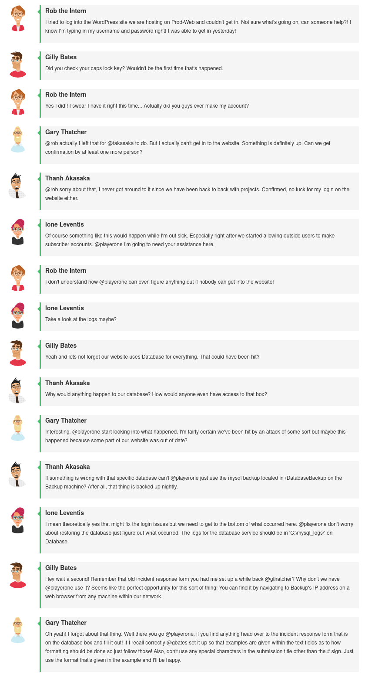
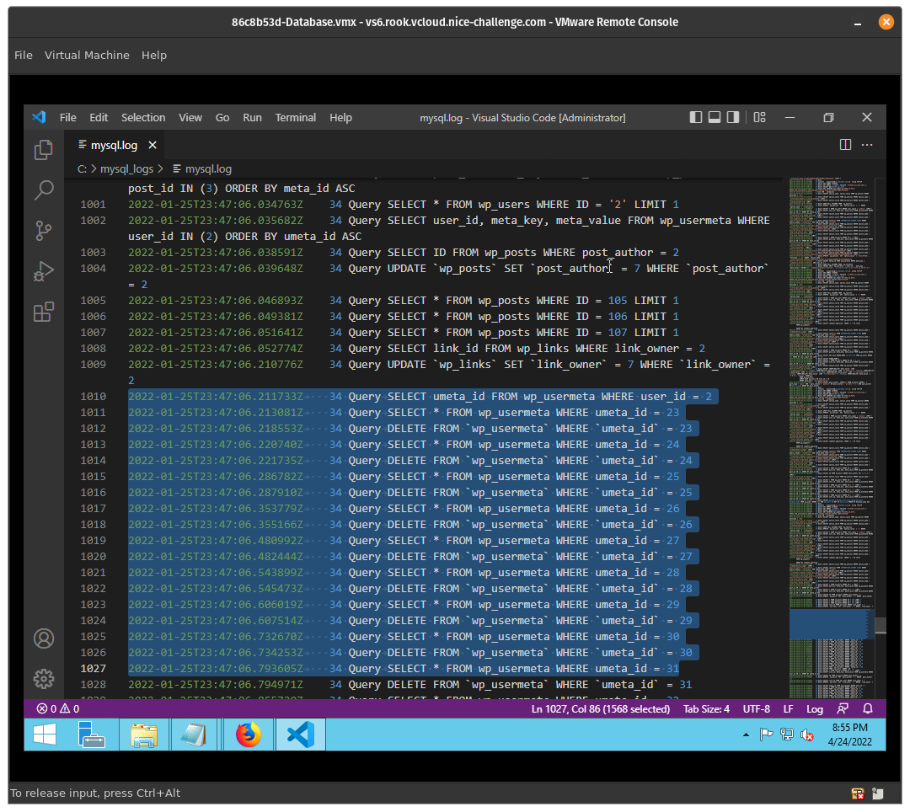
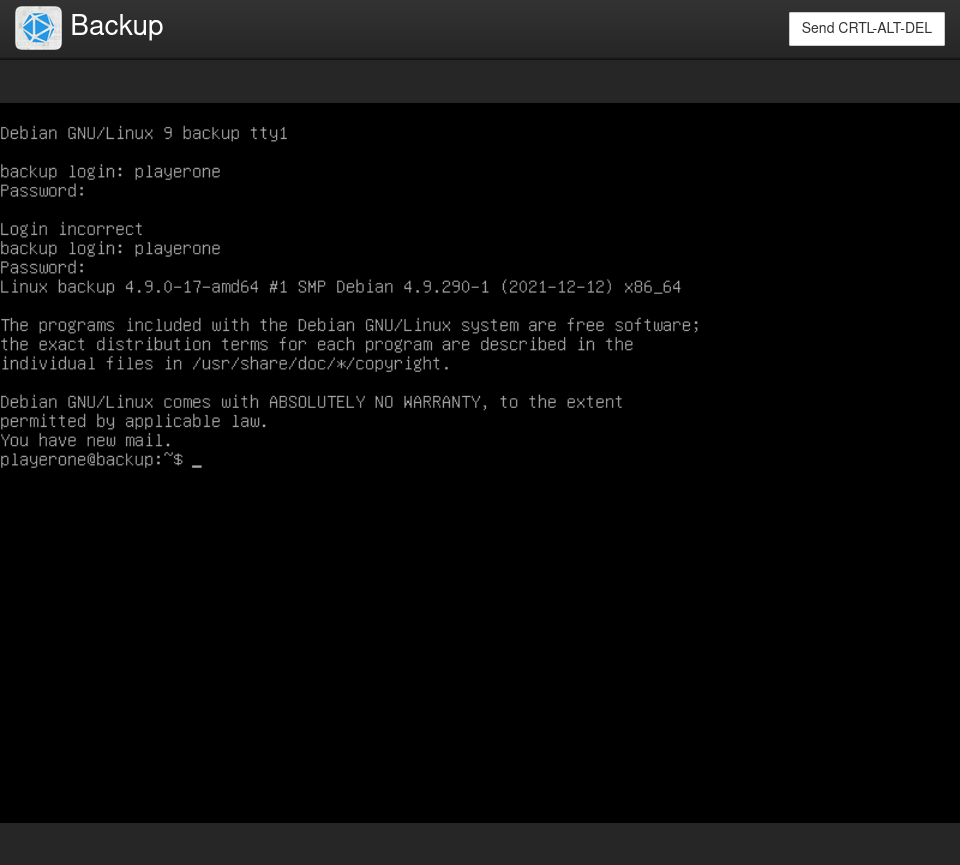
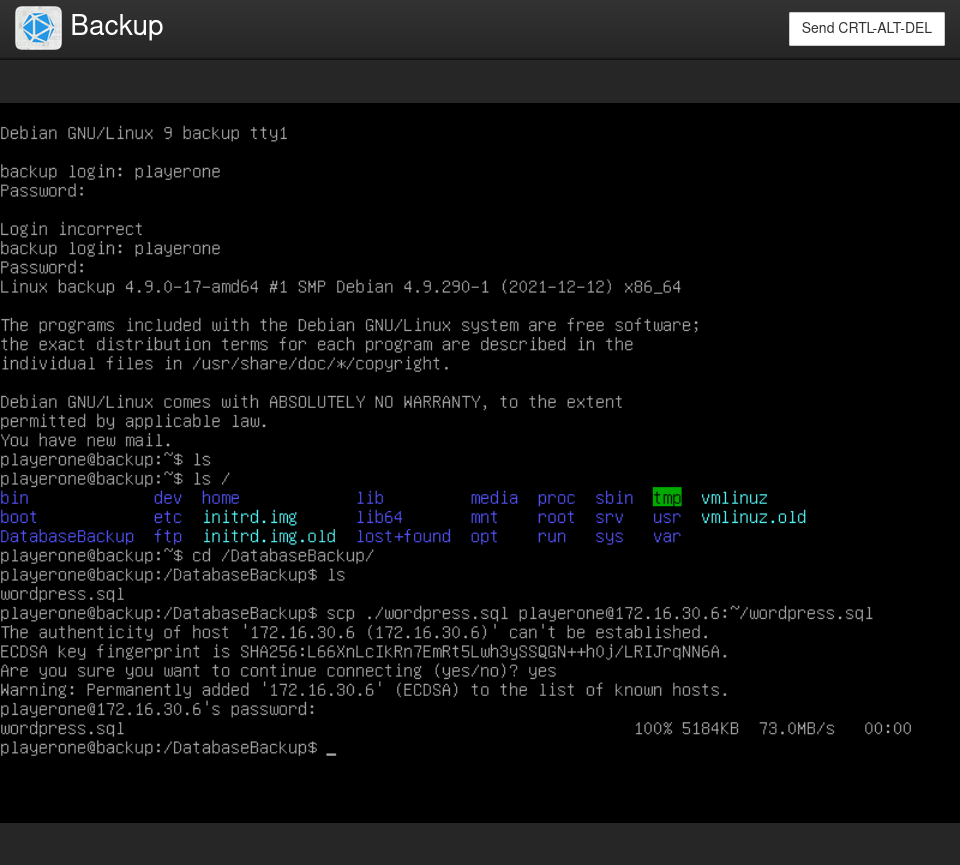
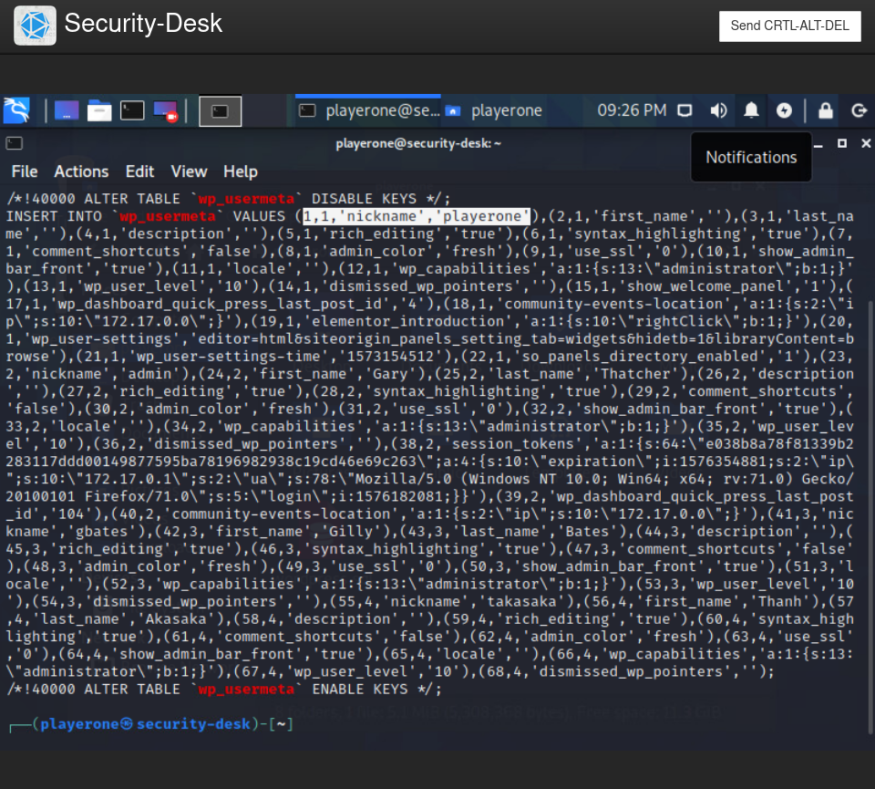
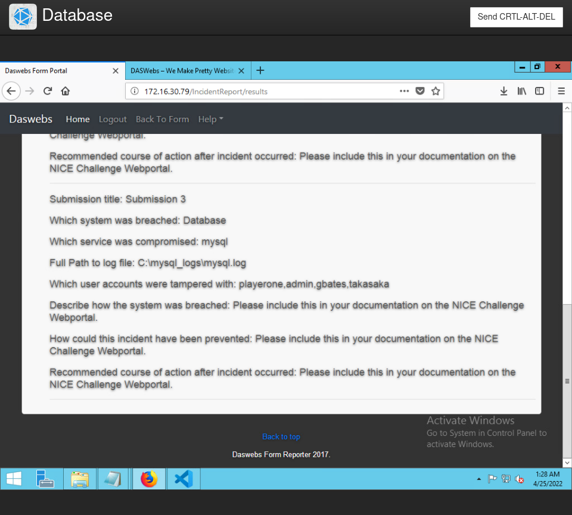
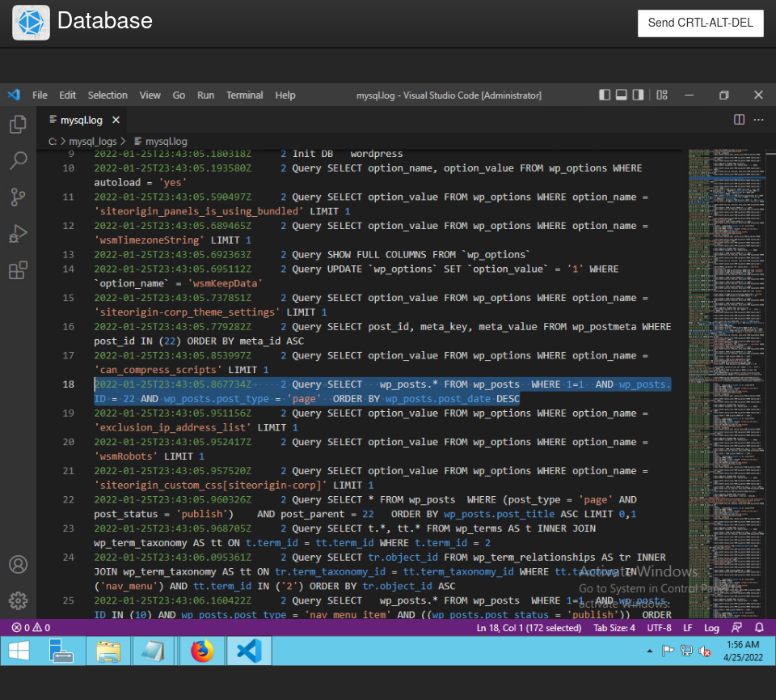

# Challenge 08 (T0166) - Lengthy Logs: Attack Analysis


## Challenge Info
**Author:** Alexander Hillock & Daniel Killam & Luis Pena<br>
**Framework Category:** Protect and Defend<br>
**Specialty Area:** Cybersecurity Defense Analysis<br>
**Work Role:** Cyber Defense Analyst<br>
**Task Description:** Perform event correlation using information gathered from a variety of sources within the enterprise to gain situational awareness and determine the effectiveness of an observed attack.

### Scenario
Lately, employees have been having some issues logging in to one of our Wordpress websites and we can't figure out why. Our security analyst suspects that we might have been hit by a cyber attack, but is currently indisposed and can't look into it. I need you to take a look and confirm whether or not we were actually hit and if so, what the impact of that attack might have been.

### Additional Information
More details and objectives about this challenge will be introduced during the challenge meeting, which will start once you begin deploying the challenge.

You will be able to check your progress during this challenge using the check panel within the workspace once the challenge is deployed. The checks within the check panel report on the state of some or all of the required tasks within the challenge.

Once you have completed the requested tasks, you will need to document the methodology you used with as much detail and professionalism as necessary. This should be done on the documentation tab within the workspace once the challenge is deployed. Below the main documentation section be sure to include a tagged list of applications you used to complete the challenge.

Your username/password to access all virtual machines and services within the workspace will be the following...

**Username:** `playerone`<br>
**Password:** `password123`

The username/password used to access the Firewall's web interface within the workspace will be the following...

**Username:** `admin`
**Password:** `password123`

The web form used for this challenge accepts 8 submissions.
When evaluating individual check states, the automated check system ignores submissions made beyond this limit.

## Meeting Notes


## Network Map


## Documentation
The meeting notes for the challenge immediately direct you to the `Database` (`172.16.20.4`) machine--where I found the database logs at `C:\mysql_logs\mysql.log`. 

The log file was difficult to parse in the server's default text editor (Notepad), so I decided to install Visual Studio Code to view the logs.

Starting at Line 1010, I can see suspicious logs of what seems to be accounts for the website being deleted.



However, the accounts are referenced by a `umeta_id` number, and there's no indication of what IDs correlate to which accounts in the logs.

To find the IDs to accounts associated, I logged into the `backup` machine (`172.16.30.79`) and secure-copied (i.e. SCP) the database backup to the `Security-Workstation` machine (`172.16.30.6`)






I then logged into `Security-Workstation` and use `grep wp_usermeta ~/wordpress.sql` to look for information on the accounts in the database and their IDs, and I found the needed information.



As indicated in the above screenshot, the first thing I noticed was data in a particular structure:

```
1,1,'nickname','playerone'
```

I deduced that the first value was likely the user ID, the second value referenced the "row" of data for a particular user account, the third value was any generic name assigned to an account, and the fourth value was the username itself (e.g. `playeron`). With this, I identified four accounts to their corresponding user IDs:

- `playerone` (1)
- `admin` (24)
- `gbates` (41)
- `takasaka` (53)

I then referenced the database logs to identify the deleted account ID ranges:

- 1 - 36 
- 38 - 69

These pieces of information confirmed that the above four accounts were deleted by the attacker.



The database was breached by what seemed to be a SQL injection attack. You can see evidence of this in the logs--such as mentions of `WHERE 1=1`:



The website's vulnerability to SQL injections gave the attacker access to the database--allowing him/her to compromise the integrity of the data in said database.

To remediate the damage, the database can be restored from our backups. However, long-term remediation will involve re-programming the website to remove the SQL injection vulnerability--typically by implementing input sanitization for any user inputs (such as login pages or comment pages) on the website.

## NICE Framework & CAE KU Mapping

### NICE Framework KSA
- K0004. Knowledge of cybersecurity and privacy principles.
- K0005. Knowledge of cyber threats and vulnerabilities.
- K0042. Knowledge of incident response and handling methodologies.
- K0044. Knowledge of cybersecurity and privacy principles and organizational requirements (relevant to confidentiality, integrity, availability, authentication, non-repudiation).
- K0060. Knowledge of operating systems.
- K0070. Knowledge of system and application security threats and vulnerabilities (e.g., buffer overflow, mobile code, cross-site scripting, Procedural Language/Structured Query Language [PL/SQL] and injections, race conditions, covert channel, replay, return-oriented attacks, malicious code).
- K0161. Knowledge of different classes of attacks (e.g., passive, active, insider, close-in, distribution attacks).
- K0167. Knowledge of system administration, network, and operating system hardening techniques.
- K0192. Knowledge of Windows/Unix ports and services.
- K0297. Knowledge of countermeasure design for identified security risks.
- K0318. Knowledge of operating system command-line tools.

### CAE Knowledge Units
- Cybersecurity Foundations
- Cybersecurity Principles
- Cyber Threats
- Operating Systems Administration
- Operating Systems Concepts
- Vulnerability Analysis