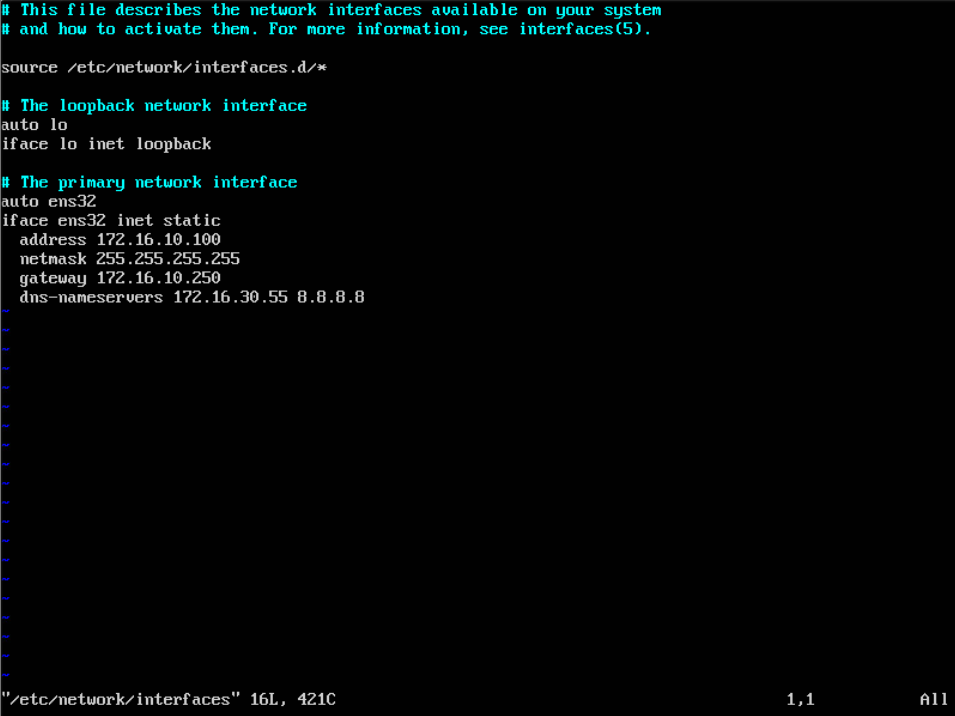
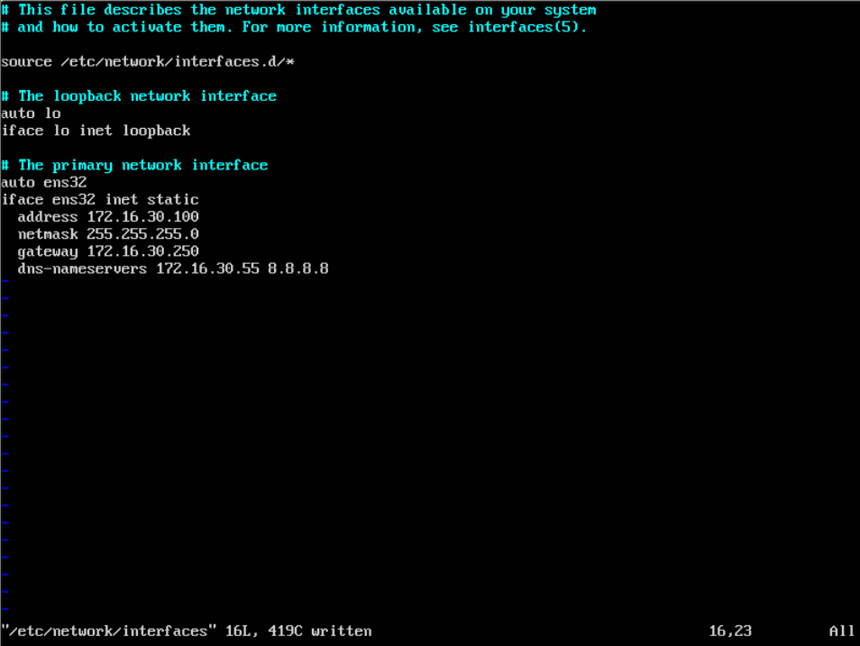
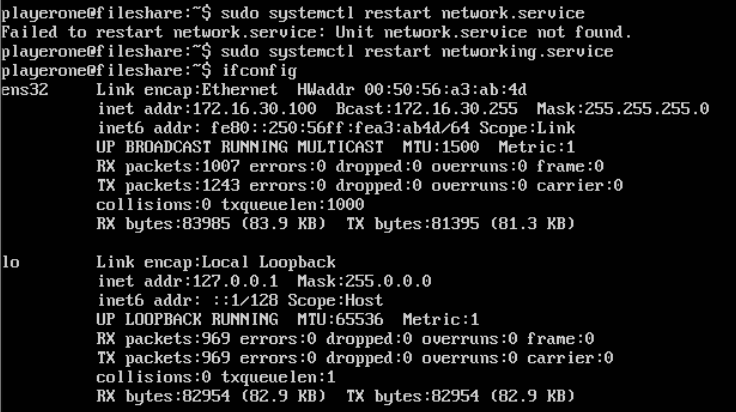
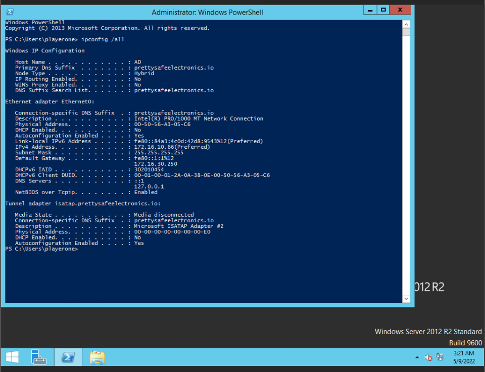
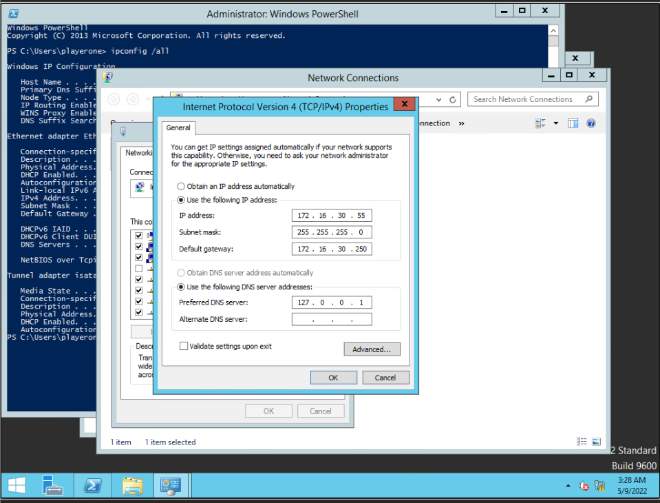
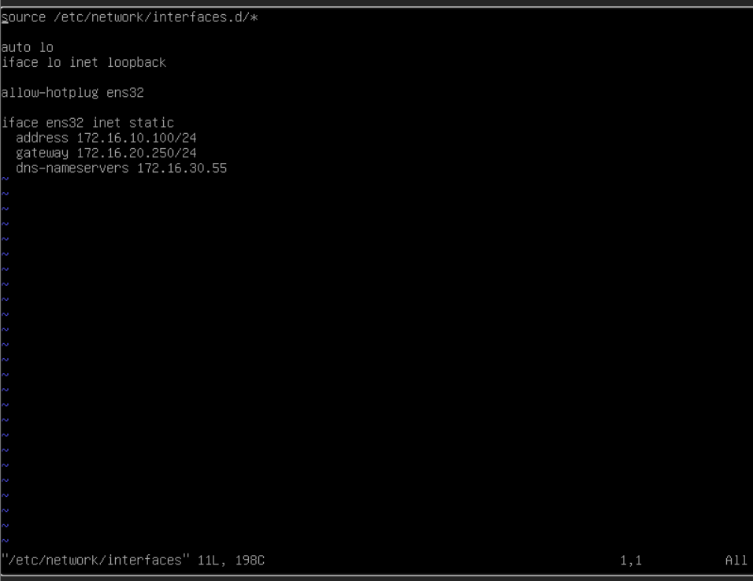
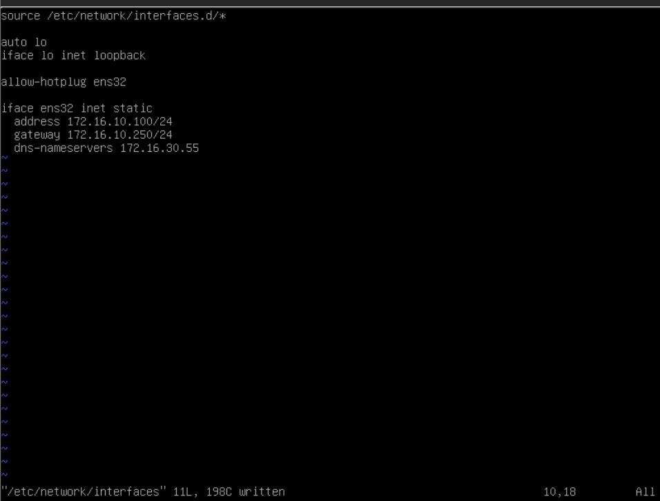
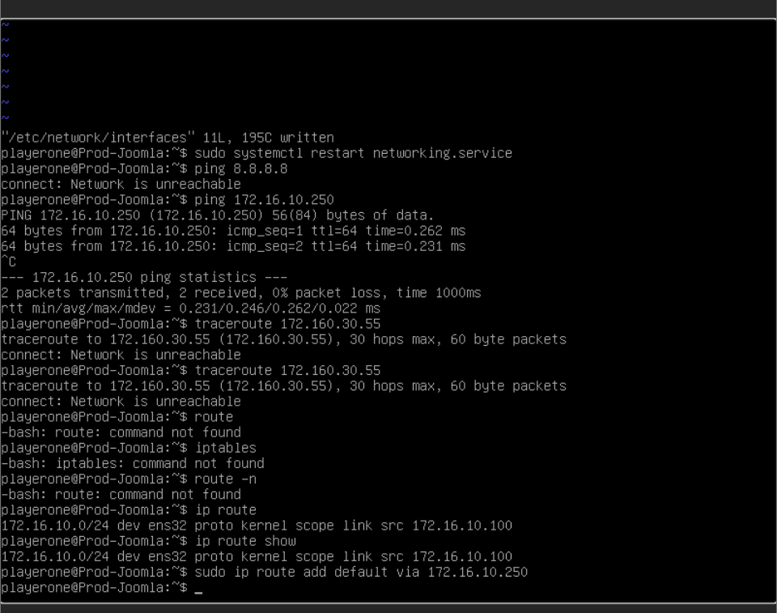
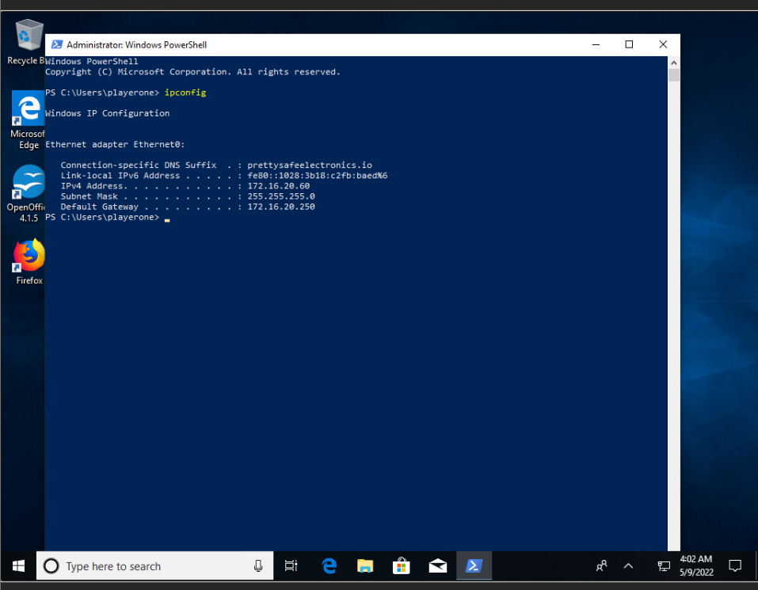

# Challenge 09 (T0291) - Configuration Management Gone Awry

## Challenge Info
**Author:** Bailey Kasin 
**Framework Category:** Protect and Defend 
**Specialty Area:** Cybersecurity Defense Analysis 
**Work Role:** Cyber Defense Analyst 
**Task Description:** Examine network topologies to understand data flows through the network.

### Scenario
An error in our managed service providers automated configuration management software has caused considerable damage to our network. Multiple systems and network pathways are now misconfigured and unable to be reconfigured with the automated tool. This downtime is costing the company considerably in online sales, in store sales, and employee productivity. We need you to manually reconfigure the affected systems and networking equipment to get us back online.

### Additional Information
More details and objectives about this challenge will be introduced during the challenge meeting, which will start once you begin deploying the challenge.

You will be able to check your progress during this challenge using the check panel within the workspace once the challenge is deployed. The checks within the check panel report on the state of some or all of the required tasks within the challenge.

Once you have completed the requested tasks, you will need to document the methodology you used with as much detail and professionalism as necessary. This should be done on the documentation tab within the workspace once the challenge is deployed. Below the main documentation section be sure to include a tagged list of applications you used to complete the challenge.

Your username/password to access all virtual machines and services within the workspace will be the following... 
**Username:** `playerone`
**Password:** `password123`

The username/password used to access the Firewall's web interface within the workspace will be the following...
**Username:** `admin`
**Password:** `password123`

## Meeting Notes

## Network Map

## Documentation
The root cause of every issue for every node in this challenge was a misconfigured network stack--whether that be a misconfigured assigned IP address, subnet mask, default gateway, or even a default route.

I will provide screenshots and explanations as to how I resolved each nodes' issues below.

### Fileshare
The `Fileshare` node had a misconfigured IP address, subnet mask, and default gateway. I was able to re-configure the network stack properly by editing the `/etc/network/interfaces` file on the machine in **vim**.

Incorrect config:

Correct config:

After re-configuring the network stack, I restarted the network services on the node with the command: `sudo systemctl restart networking.services`

### AD-Server
Similar to `Fileshare`, the IP address, subnet mask, and default gateway were misconfigured. Fixing this configuration was much easier--as the network stack can be configured in a GUI.

Incorrect config:

Correct config:

### Prod-Joomla
Fixing this node was very tricky. Not only were the IP address and subnet mask were configured, but the device lacked a default route to its default gateway (which wasn't that obvious to me--as I'm not too familar with Debian).

Incorrect config:

Correct config:

Fixing default routing:

The command that I used to fix the default routing was: `sudo ip route add default via 172.16.10.250`

### Workstation-Desk
Fixing this node's network stack was extremely similar to `AD-Server`--but the catch was that it wasn't quite obvious to figure out how to log into the node to fix its configuration. The Windows workstation would fail to authenticate due to not being able to communicate with `AD-Server` for domain authentication (caused by its networking issue).

To get around this blockade, I instead logged in as `.\playerone` (i.e. a local user account called `playerone` versus a domain user account). This allowed me to log in and fix the network stack in the GUI.

## NICE Framework & CAE KU Mapping

### NICE Framework KSA

### CAE Knowledge Units

