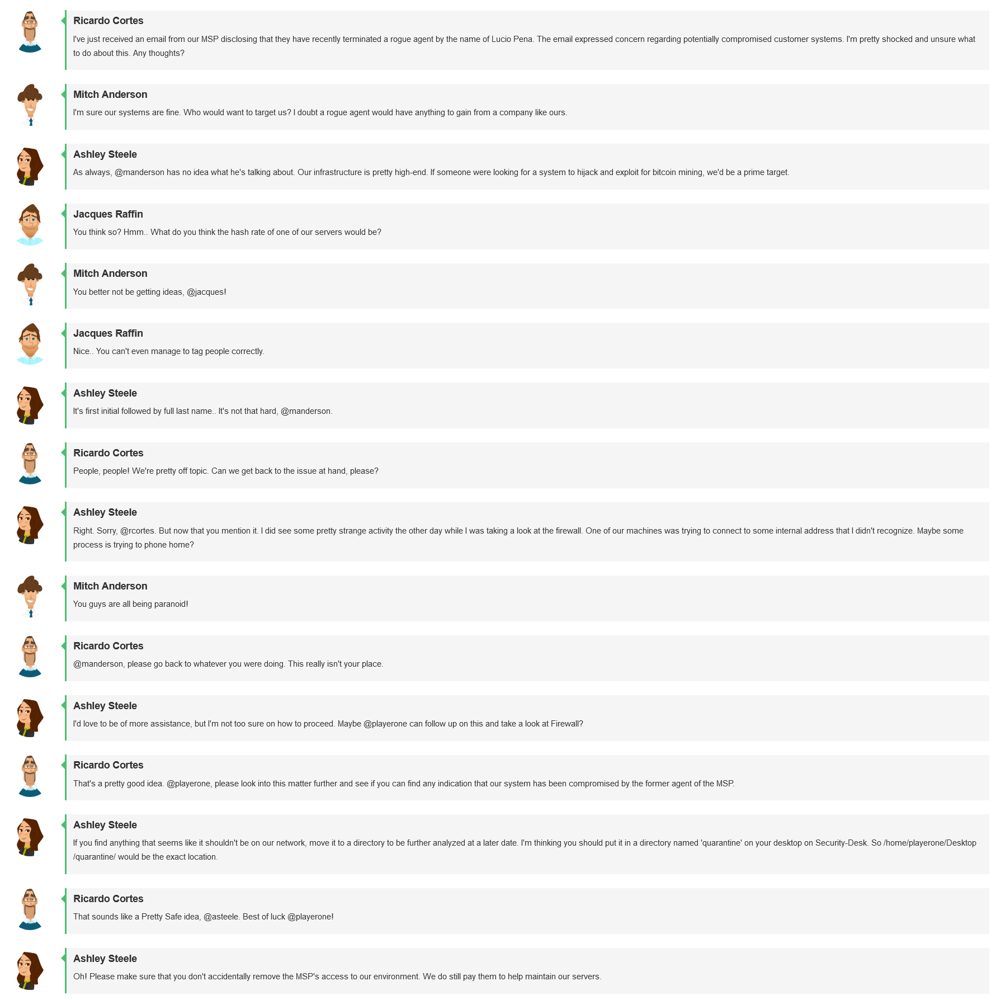
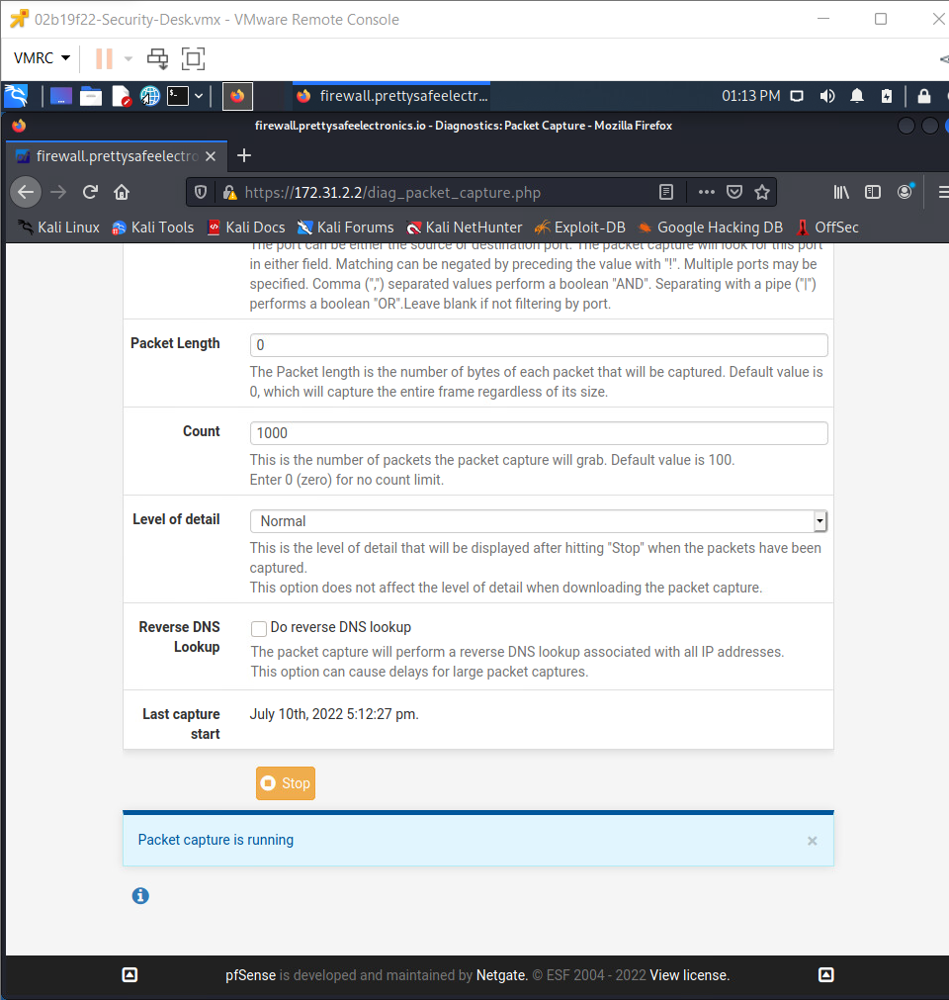
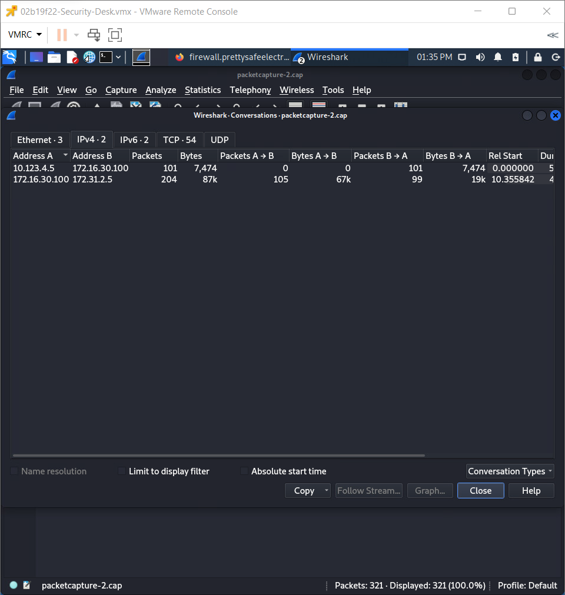
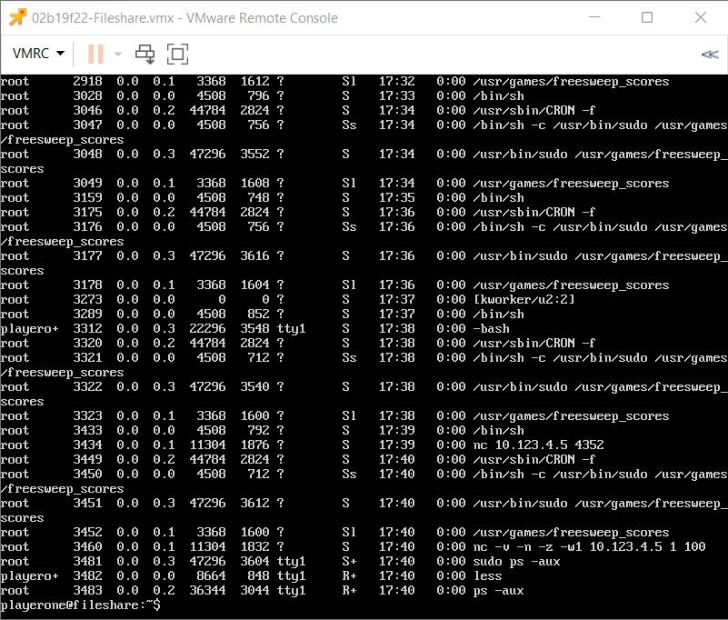
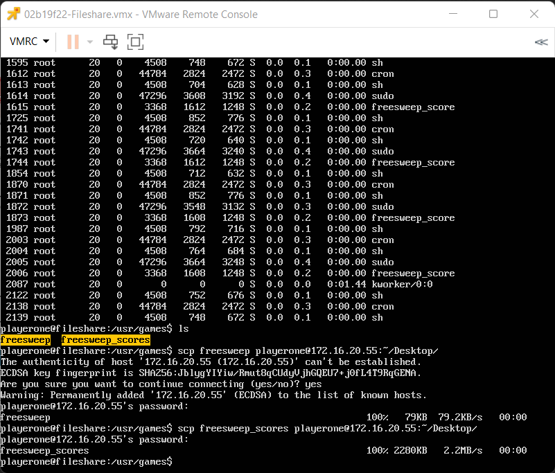
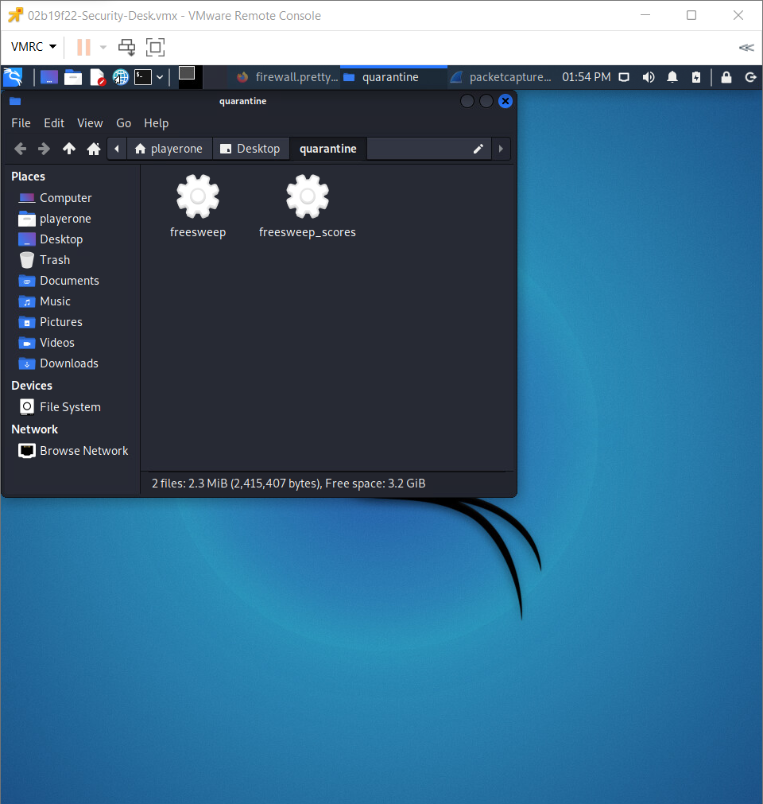
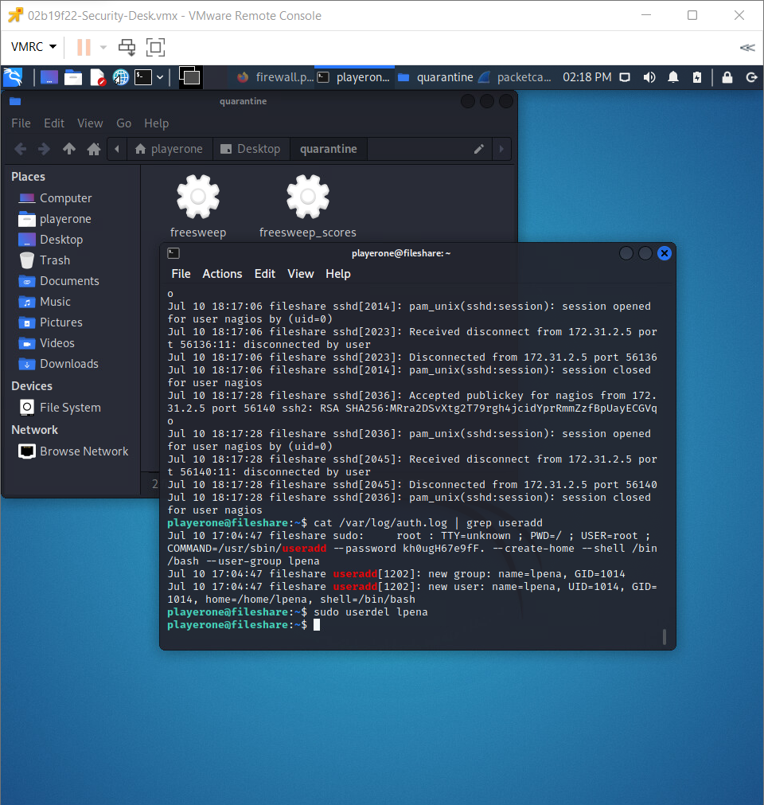

# Challenge 12 (T0278) - Malware Aftermath Cleanup

## Challenge Info
**Author:** Bailey Kasin 
**Framework Category:** Protect and Defend 
**Specialty Area:** Incident Response 
**Work Role:** Cyber Defense Incident Responder 
**Task Description:** Collect intrusion artifacts (e.g., source code, malware, Trojans) and use discovered data to enable mitigation of potential cyber defense incidents within the enterprise.

### Scenario
Recently, malicious activity has been discovered within our network. We need you to go through the affected systems and collect any malicious artifacts you come across. If any changes were made to the host systems due to the malware you will need to remediate the harmful effects.

### Additional Information
More details and objectives about this challenge will be introduced during the challenge meeting, which will start once you begin deploying the challenge.

You will be able to check your progress during this challenge using the check panel within the workspace once the challenge is deployed. The checks within the check panel report on the state of some or all of the required tasks within the challenge.

Once you have completed the requested tasks, you will need to document the methodology you used with as much detail and professionalism as necessary. This should be done on the documentation tab within the workspace once the challenge is deployed. Below the main documentation section be sure to include a tagged list of applications you used to complete the challenge.

Your username/password to access all virtual machines and services within the workspace will be the following... 
Username: `playerone` 
Password: `password123`

The username/password used to access the Firewall's web interface within the workspace will be the following... 
Username: `admin` 
Password: `password123`

## Meeting Notes

## Network Map

## Documentation
I began my investigating by logging into the web GUI for the firewall (`172.31.2.2`) via the Security-Desk Kali Linux computer. I initiated a packet capture on the `PROD` interface of the firewall (`172.16.30.0/24`).

Upon completing the packet capture and inspecting it in Wireshark, I noticed that the Fileshare server (`172.16.30.100`) was attempting to establish a TCP handshake with an unknown endpoint (`10.123.4.5`).

The Fileshare server seemed to be possibly compromised, so I logged onto it via SSH and took a look at its running processes. There were two suspicious processes that were running: `/usr/games/freesweep` and `/usr/games/freesweep_scores`

Both of these processes originated from binaries located in the `/usr/games` directory.

I used `scp` to copy the artifacts to the quarantine folder on the Security-Desk machine and then deleted the original copies on the Fileshare server. Afterwards, I rebooted the server to ensure any running processes of the binaries were terminated. Since the original binaries were deleted, the processes could not start up again.

Lastly, I looked for the malicious user that likely configured the malware on the Fileshare server. The meeting notes stated that the rogue actor was Lucio Pena, and I found his user account on the server--which I then promptly removed.

## NICE Framework & CAE KU Mapping

### NICE Framework KSA
* K0004. Knowledge of cybersecurity and privacy principles.
* K0005. Knowledge of cyber threats and vulnerabilities.
* K0070. Knowledge of system and application security threats and vulnerabilities (e.g., buffer overflow, mobile code, cross-site scripting, Procedural Language/Structured Query Language [PL/SQL] and injections, race conditions, covert channel, replay, return-oriented attacks, malicious code).
* K0162. Knowledge of cyber attackers (e.g., script kiddies, insider threat, non-nation state sponsored, and nation sponsored).
* K0167. Knowledge of system administration, network, and operating system hardening techniques.
* K0259. Knowledge of malware analysis concepts and methodologies.
* S0003. Skill of identifying, capturing, containing, and reporting malware.
* S0079. Skill in protecting a network against malware. (e.g., NIPS, anti-malware, restrict/prevent external devices, spam filters).

### CAE Knowledge Units
* Cybersecurity Foundations
* Cybersecurity Principles
* Operating Systems Administration
* Operating Systems Concepts