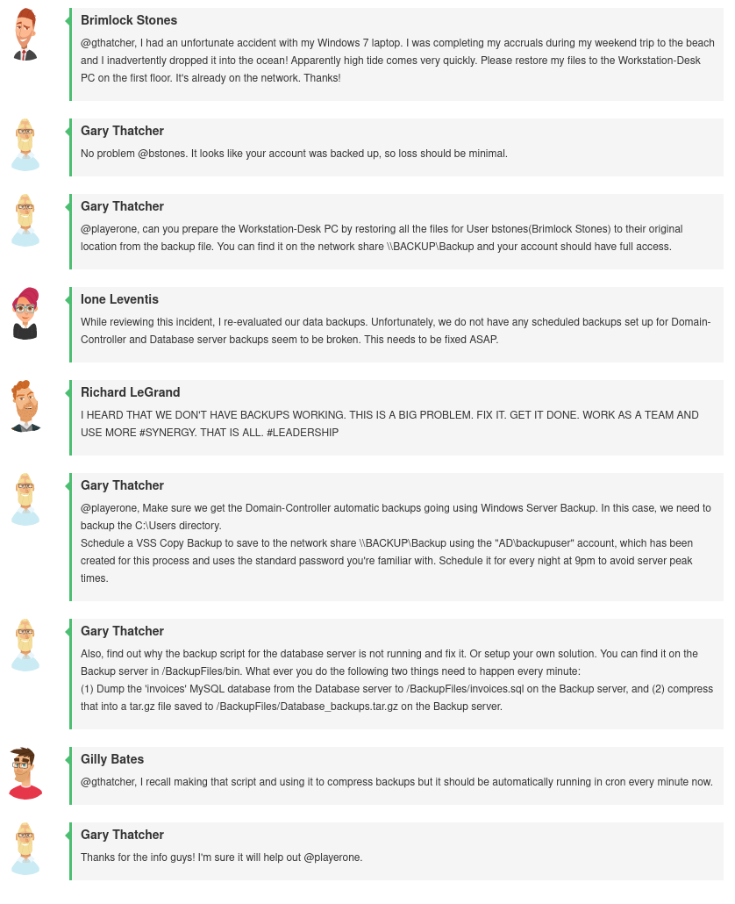
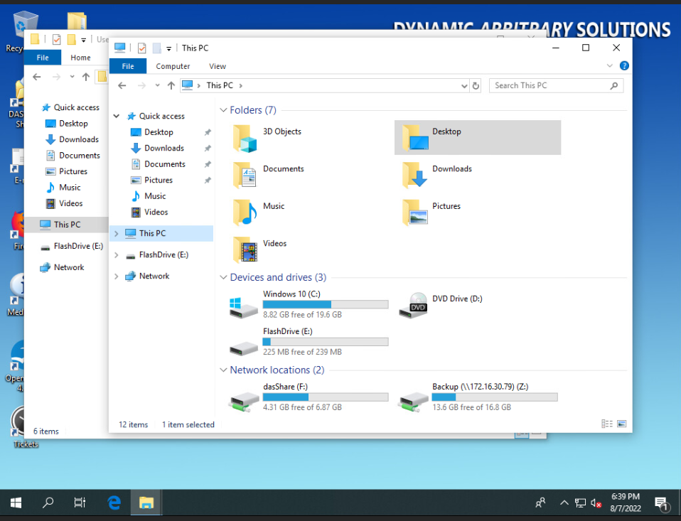
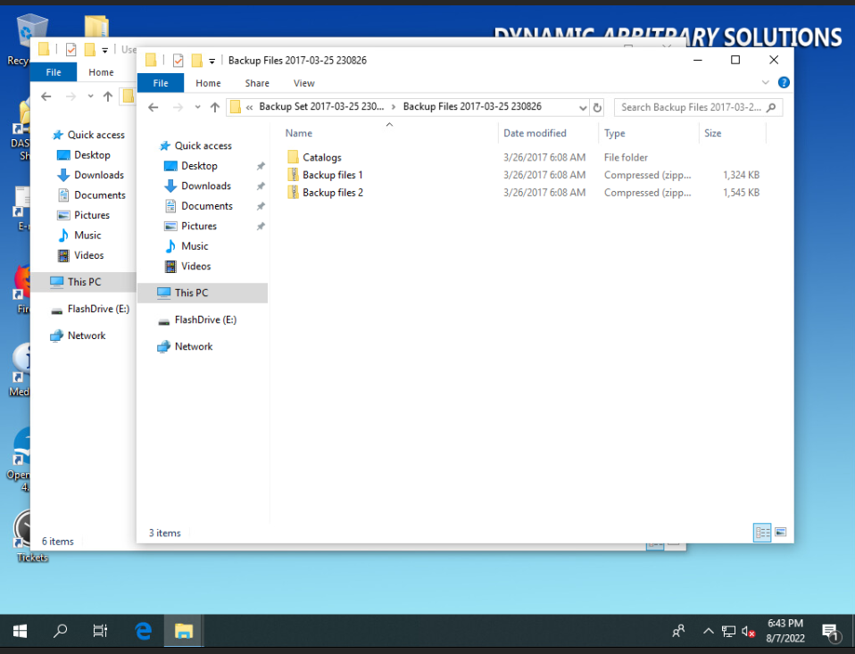
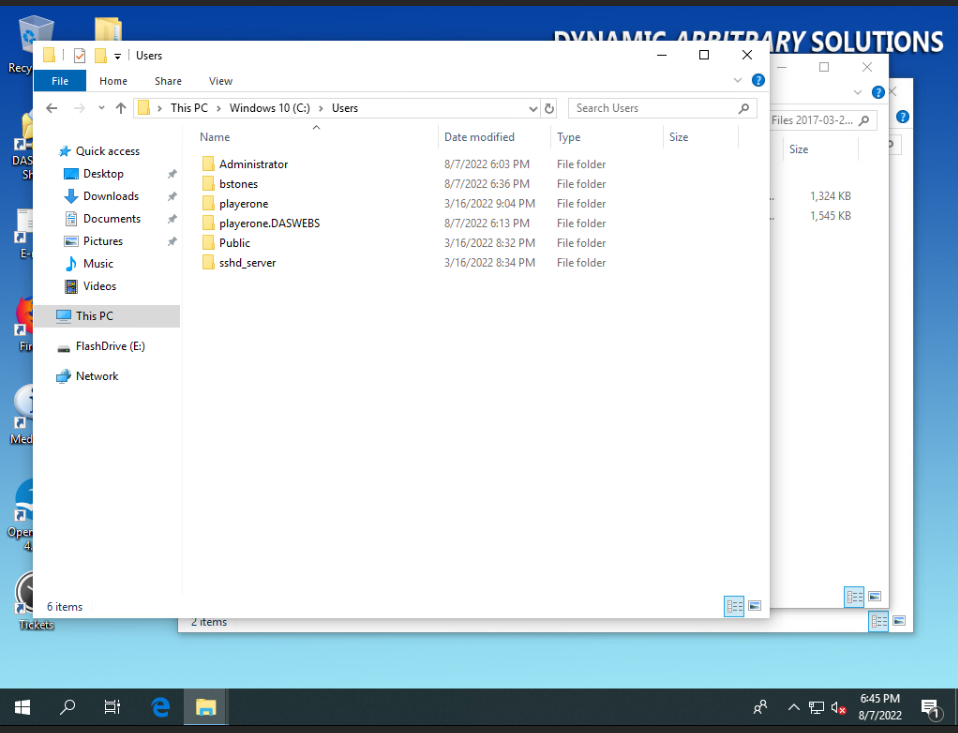
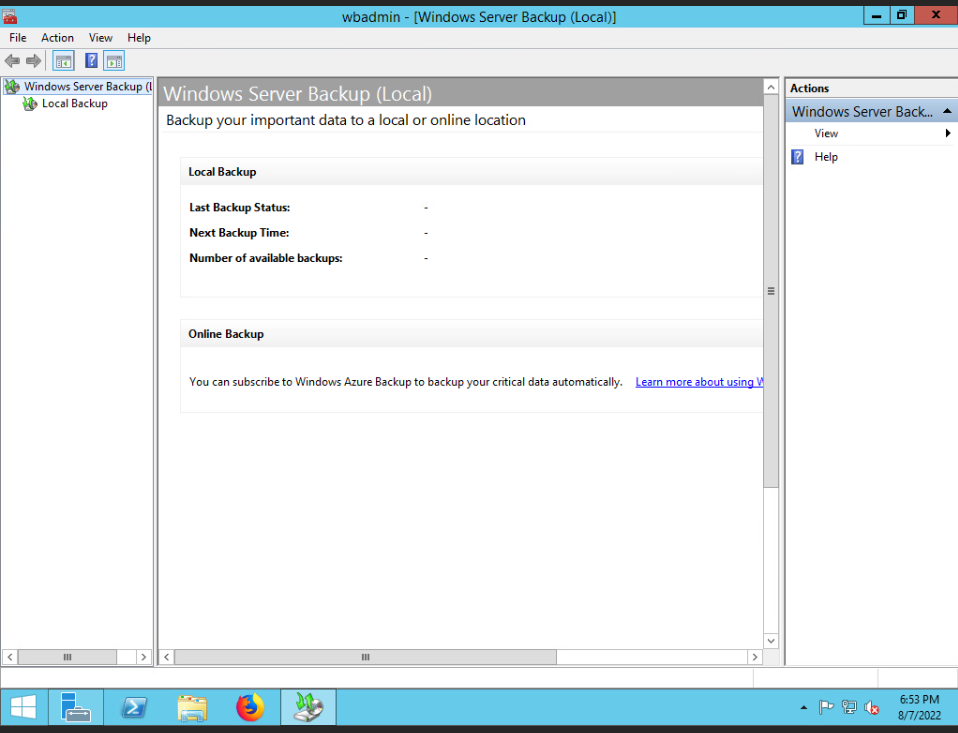
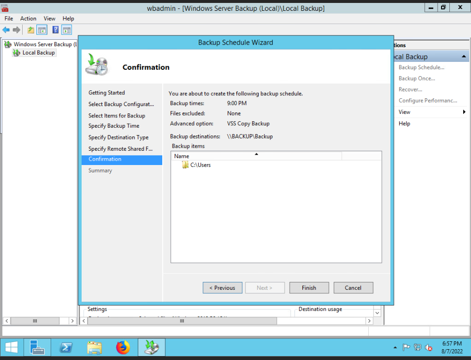
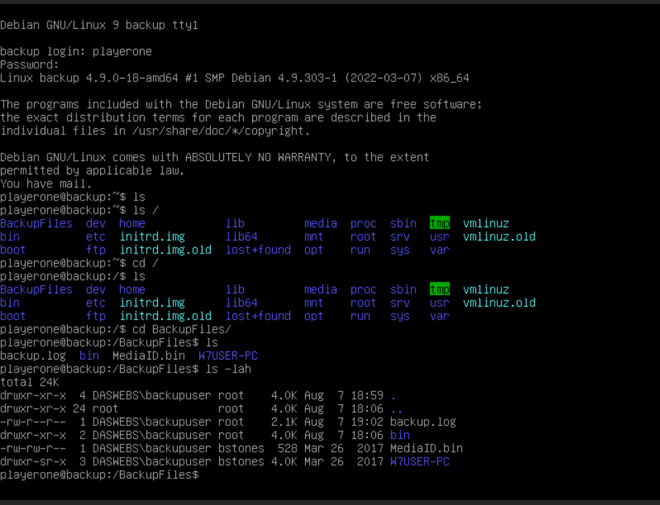
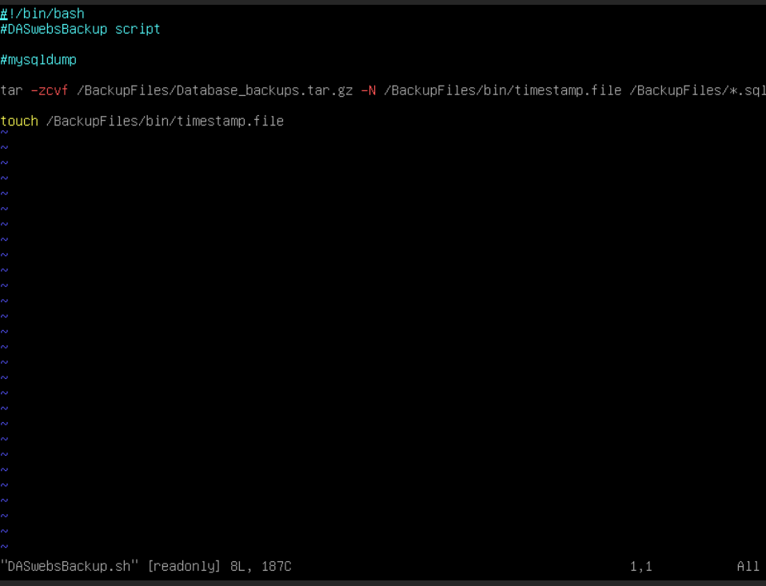
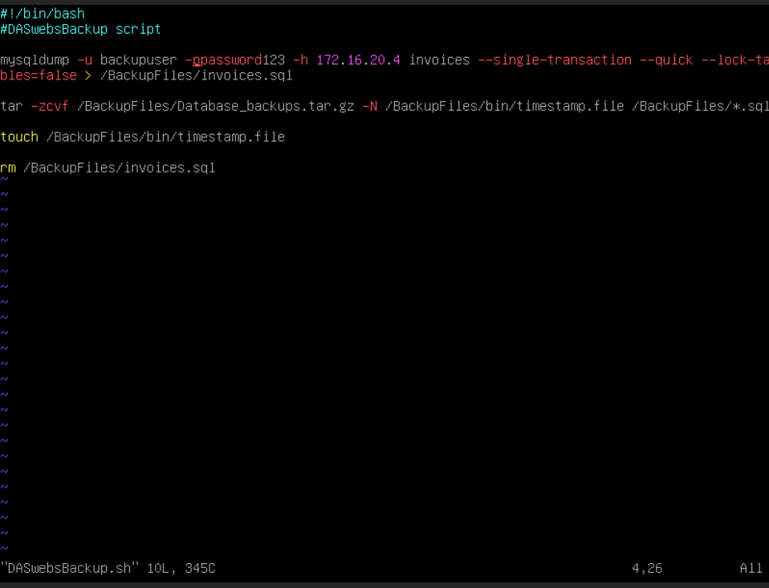
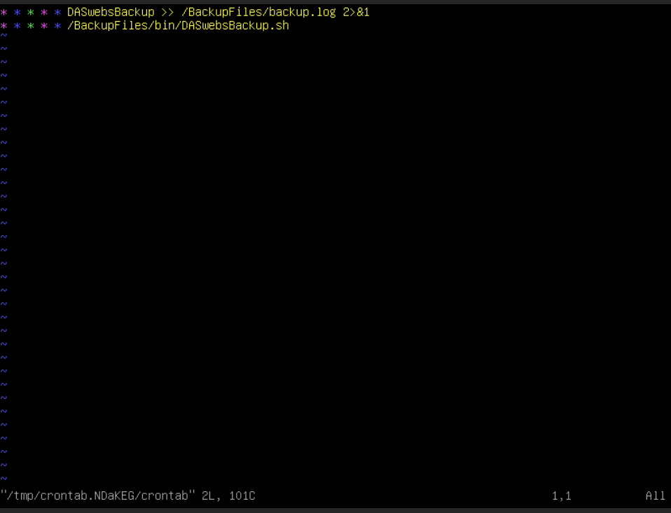

# Challenge 14 (T0186) - Backup everything in case of... Ocean?

## Challenge Info
**Author:** Patrick Gillespie Jr. 
**Framework Category:** Operate and Maintain 
**Specialty Area:** Systems Administration 
**Work Role:** System Administrator 
**Task Description:** Plan, execute, and verify data redundancy and system recovery procedures.

### Scenario
The accountant had an accident with his laptop and needs his backed-up files put temporarily on the Workstation-Desk PC. Upon review of the situation our security analyst notes that the status of our core infrastructure backups is shaky at best. To get back on track you need to help restore those files for the accountant and resolve some backup issues with Windows and Linux servers.

### Additional Information
More details and objectives about this challenge will be introduced during the challenge meeting, which will start once you begin deploying the challenge.

You will be able to check your progress during this challenge using the check panel within the workspace once the challenge is deployed. The checks within the check panel report on the state of some or all of the required tasks within the challenge.

Once you have completed the requested tasks, you will need to document the methodology you used with as much detail and professionalism as necessary. This should be done on the documentation tab within the workspace once the challenge is deployed. Below the main documentation section be sure to include a tagged list of applications you used to complete the challenge.

Your username/password to access all virtual machines and services within the workspace will be the following... 
Username: `playerone` 
Password: `password123`

The username/password used to access the Firewall's web interface within the workspace will be the following... 
Username: `admin` 
Password: `password123`

## Meeting Notes

## Network Map

## Documentation
### Restore Brimlocks files to Workstation
I started by logging into the `Workstation-Desk` computer and attaching the `Backup` server's shared folder as a network drive map to the `Workstation-Desk`.

In this shared folder, these was two ZIP files labeled as backups.

I unzipped `Backup files 1.zip` and copied the `bstones` folder in it to the `Workstation-Desk` file directory at `C:\Users\`. This resulted in the successful completion of this task.

### Configure full system backup of the Domain Controller to Backup server
For this task, I logged into the ``Domain-Controller` server and opened the *Windows Server Backup* application tool to begin configuring backups on the server.

The meeting notes stated that the `C:\Users` directory needed to be backed up to the `\\BACKUP\Backup` share using the `AD\backupuser` account. The backups needed to be scheduled for every night at 9:00 PM

This configuration resulted in this challenge being met.

### Ensure Database_backups.tar.gz continuously generated and stored on Backup server
I began by logging into the `Backup` server and inspecting the directory where the backups are being sent--and where the backup script was located.

It seems like the script only does the following:

- Runs the `tar` archiving utility app.
  - Creates a new file archive called `/BackupFiles/Database_backups.tar.gz`.
  - Checks against the `mtime` of the file `/BackupFiles/bin/timestamp.file`; if the `mtime` of the file is newer, then the `tar` command does not run.
  - Takes the input file `/BackupFiles/*.sql` for the archive job.

The main task that was missing from the script was to generate the `invoices.sql` database dump.

I made the following changes to execute a database dump of the *invoices* database table from the `Database` server:

Finally, to continuously run the backup script every minute, I made a cron job to run the script:

This resulted in completing this challenge.

## NICE Framework & CAE KU Mapping
### NICE Framework KSA
- K0021. Knowledge of data backup and recovery.
- K0056. Knowledge of network access, identity, and access management (e.g., public key infrastructure, Oauth, OpenID, SAML, SPML).
- K0060. Knowledge of operating systems.
- K0077. Knowledge of server and client operating systems.
- K0088. Knowledge of systems administration concepts.
- K0100. Knowledge of the enterprise information technology (IT) architecture.
- K0158. Knowledge of organizational information technology (IT) user security policies (e.g., account creation, password rules, access control).
- K0318. Knowledge of operating system command-line tools.
- K0346. Knowledge of principles and methods for integrating system components.
- S0143. Skill in conducting system/server planning, management, and maintenance.
- S0151. Skill in troubleshooting failed system components (i.e., servers)

### CAE Knowledge Units
- Data Administration
- Databases
- IT Systems Components
- Operating Systems Administration
- Operating Systems Concepts

