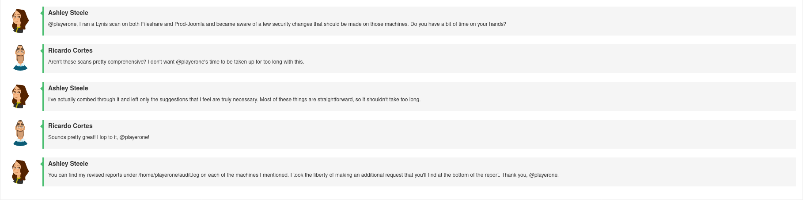
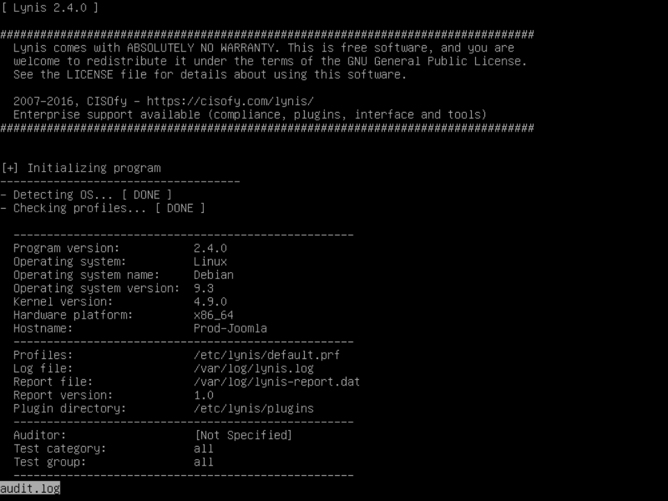
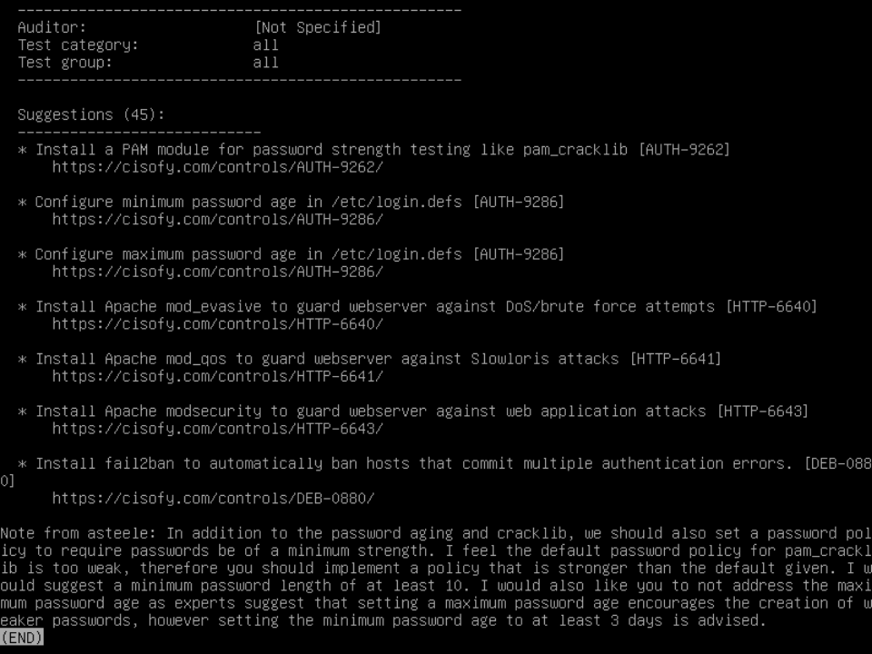
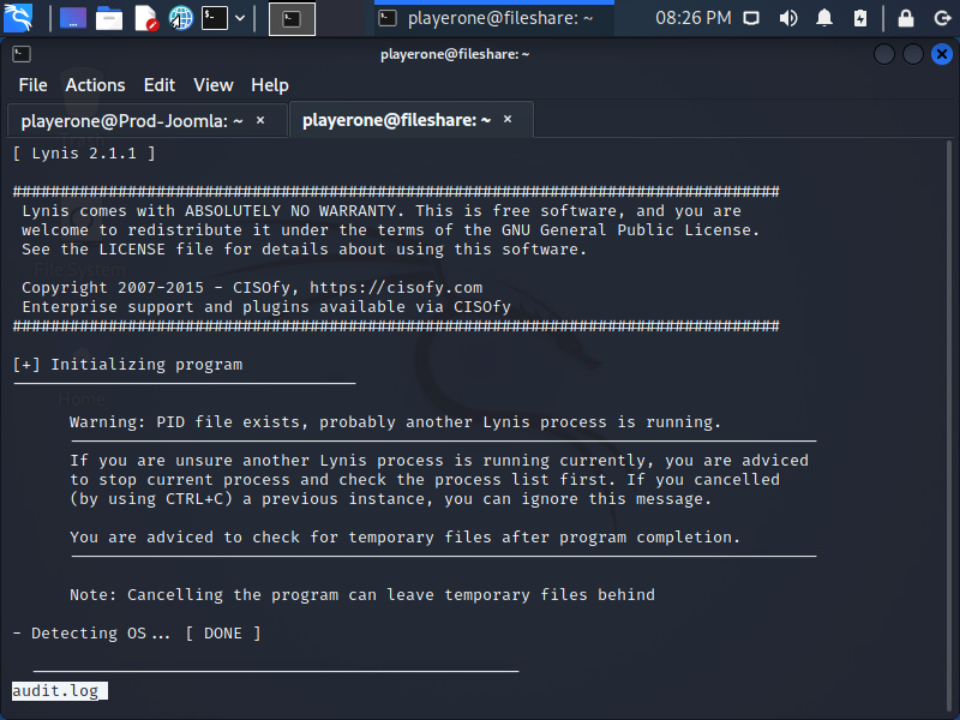
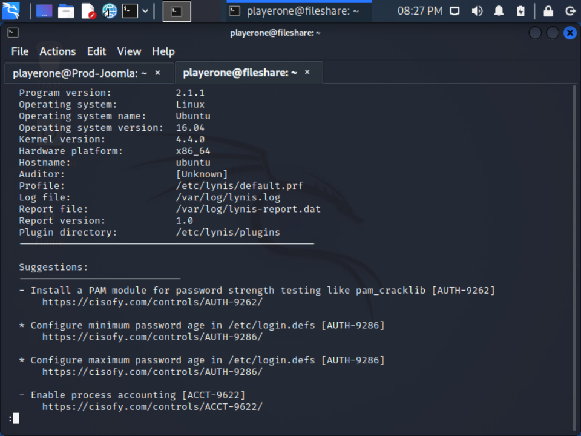
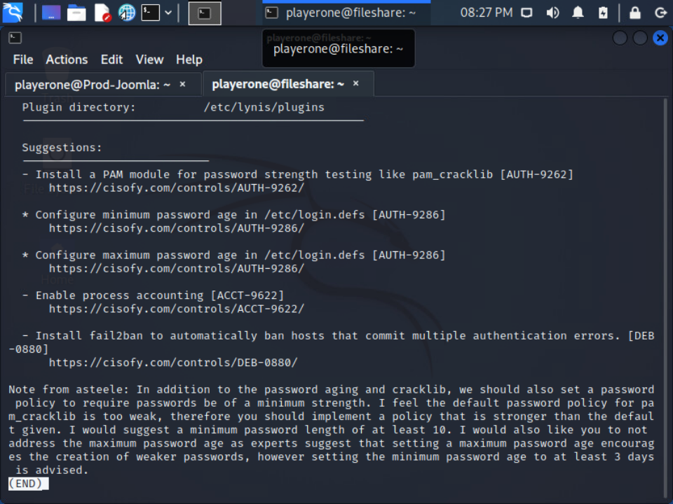
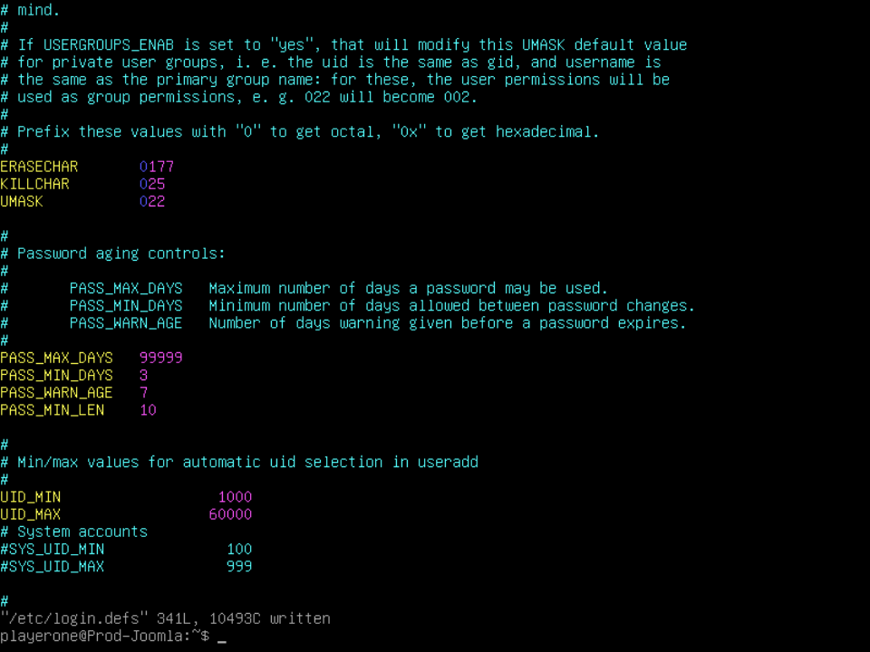
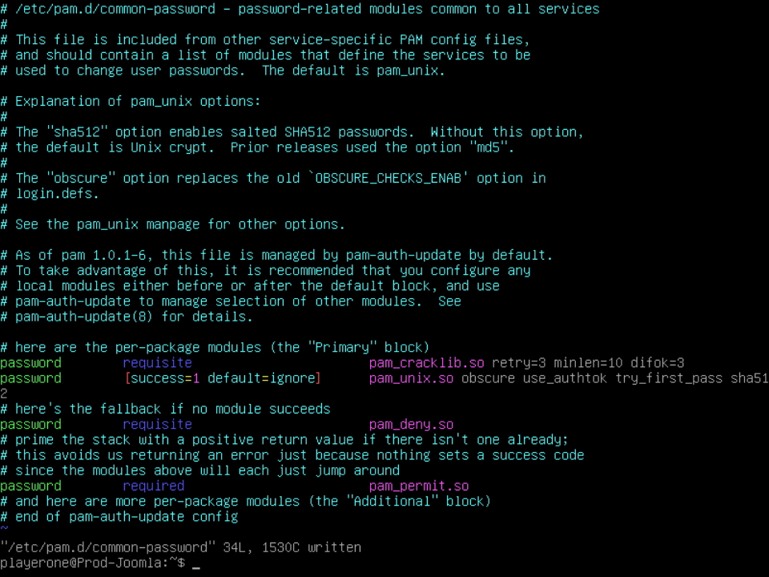
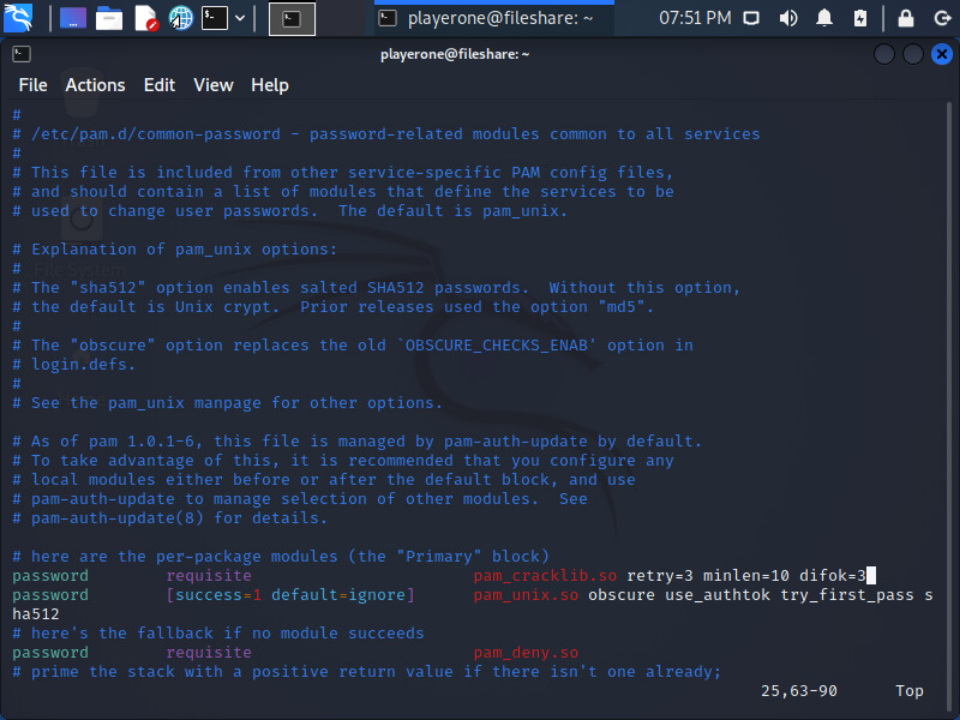
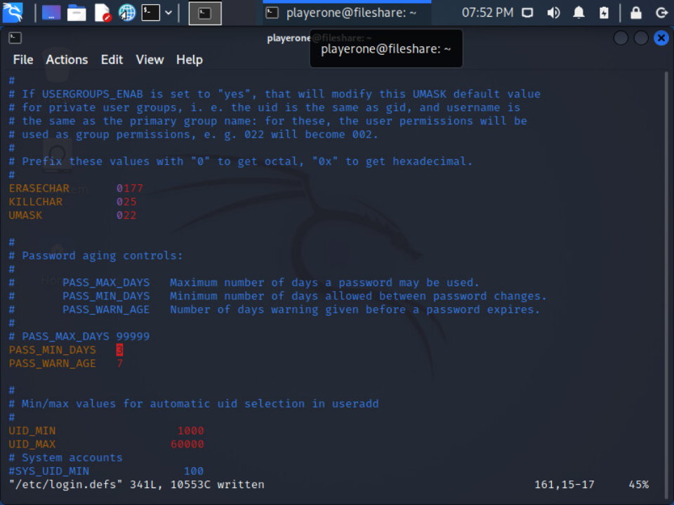

# Challenge 15 (T0187) - Engineer's Audit Advice

## Challenge Info
**Date:** Saturday, August 20, 2022<br>
**Author:** Bailey Kasin<br>
**Framework Category:** Protect and Defend<br>
**Specialty Area:** Cybersecurity Defense Analysis<br>
**Work Role:** Cyber Defense Analyst<br>
**Task Description:** Plan and recommend modifications or adjustments based on exercise results or system environment.

### Scenario
Ashley Steele has run an auditing scan on our core Linux boxes and given recommendations on how to better secure them. We need you to implement the fixes.

### Additional Information
More details and objectives about this challenge will be introduced during the challenge meeting, which will start once you begin deploying the challenge.

You will be able to check your progress during this challenge using the check panel within the workspace once the challenge is deployed. The checks within the check panel report on the state of some or all of the required tasks within the challenge.

Once you have completed the requested tasks, you will need to document the methodology you used with as much detail and professionalism as necessary. This should be done on the documentation tab within the workspace once the challenge is deployed. Below the main documentation section be sure to include a tagged list of applications you used to complete the challenge.

Your username/password to access all virtual machines and services within the workspace will be the following...<br>
Username: `playerone`<br>
Password: `password123`

The username/password used to access the Firewall's web interface within the workspace will be the following...<br>
Username: `admin`<br>
Password: `password123`

## Meeting Notes


## Network Map


## Documentation
The below documentation lists the following audit results (from Lynis) that needed to be addressed on the nodes `Prod-Joomla` and `fileshare`--along with the necessary bash commands and file configs.











### Prod-Joomla HTTP-6640
```bash
sudo apt install libapache2-mod-evasive
```

### Prod-Joomla HTTP-6641
```bash
sudo apt install libapache2-mod-qos
```

### Prod-Joomla HTTP-6643
```bash
sudo apt install libapache2-mod-security2
```

### Prod-Joomla DEB-0880
```bash
sudo apt install fail2ban
```

### Prod-Joomla AUTH-9262 and AUTH-9286 and Ashley Request
```bash
sudo apt install libpam-cracklib
```





### Fileshare ACCT-9622
```bash
sudo apt install acct
sudo /usr/sbin/accton on
```

### Fileshare DEB-0880
```bash
sudo apt install fail2ban
```

### Fileshare AUTH-9262 and AUTH-9286 and Ashley Request
```bash
sudo apt install libpam-cracklib
```





## NICE Framework & CAE KU Mapping
### NICE Framework KSA
- K0002. Knowledge of risk management processes (e.g., methods for assessing and mitigating risk).
- K0004. Knowledge of cybersecurity and privacy principles.
- K0005. Knowledge of cyber threats and vulnerabilities.
- K0007. Knowledge of authentication, authorization, and access control methods.
- K0075. Knowledge of security system design tools, methods, and techniques.
- K0167. Knowledge of system administration, network, and operating system hardening techniques.
- K0318. Knowledge of operating system command-line tools.
- S0167. Skill in recognizing vulnerabilities in security systems. (e.g., vulnerability and compliance scanning).

### CAE Knowledge Units
- Basic Cyber Operations
- Cybersecurity Foundations
- Cybersecurity Principles
- Cyber Threats
- Linux System Administration
- Network Defense
- Operating Systems Hardening
- Security Program Management
- Web Application Security
