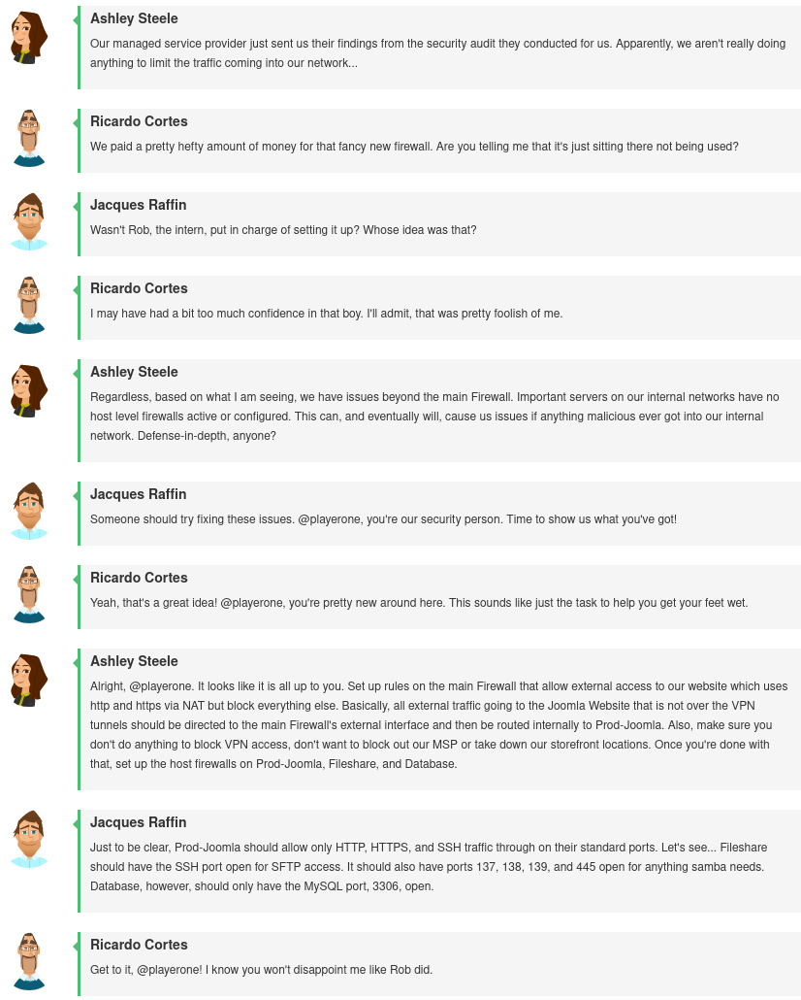
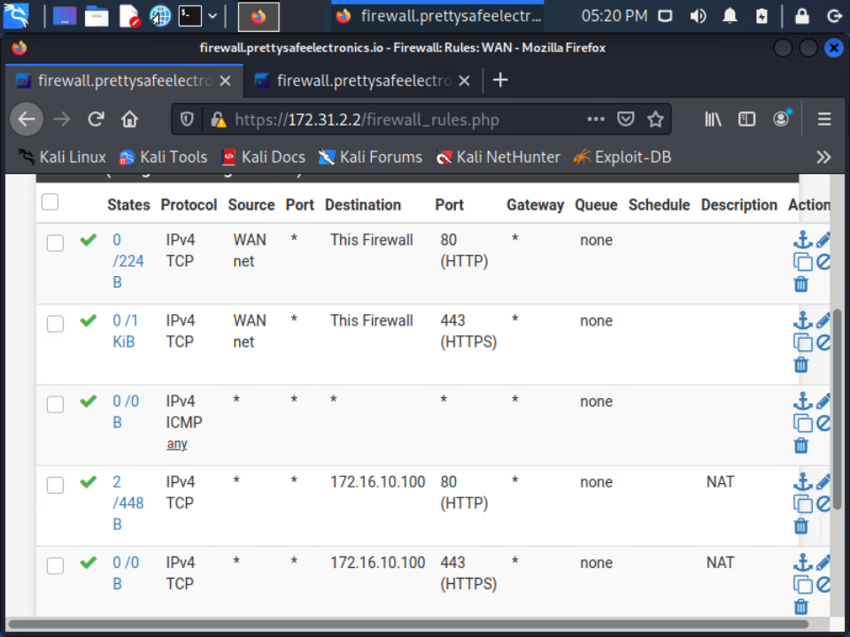
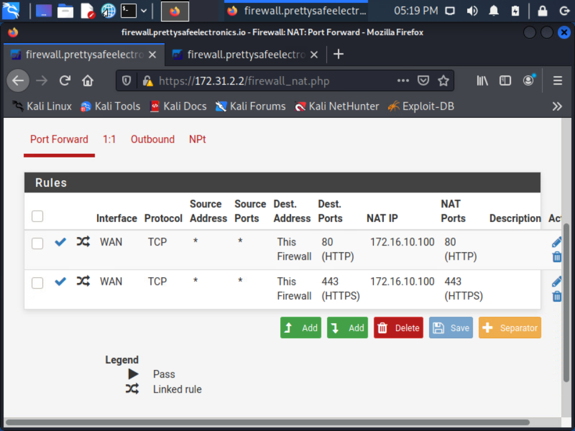
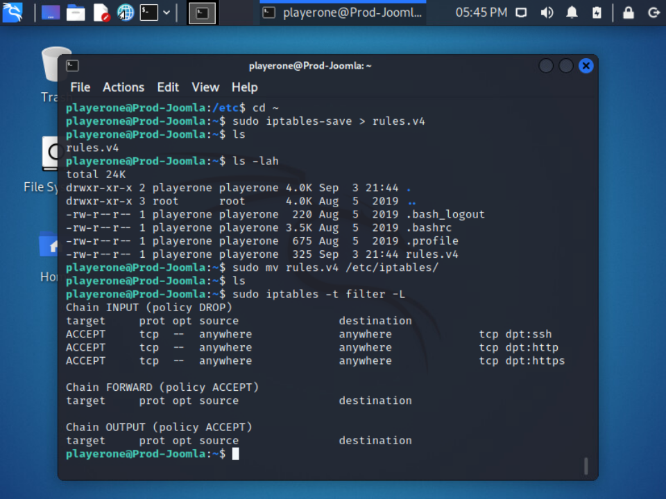
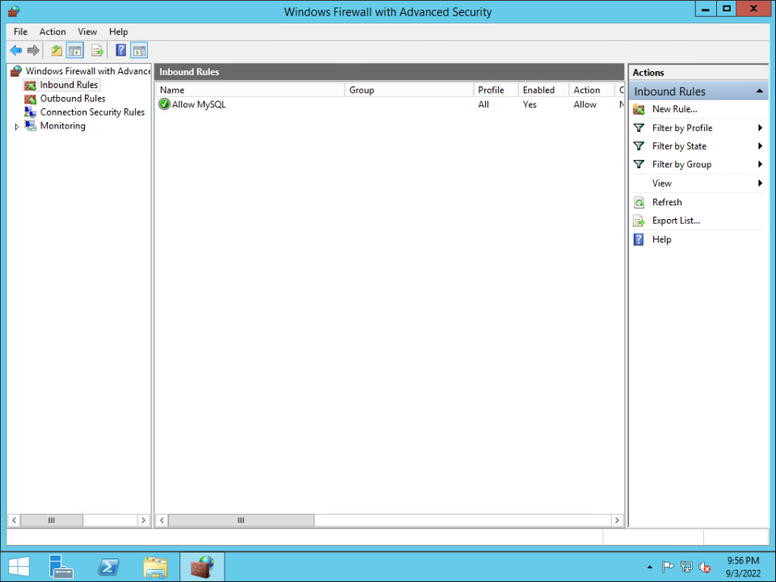
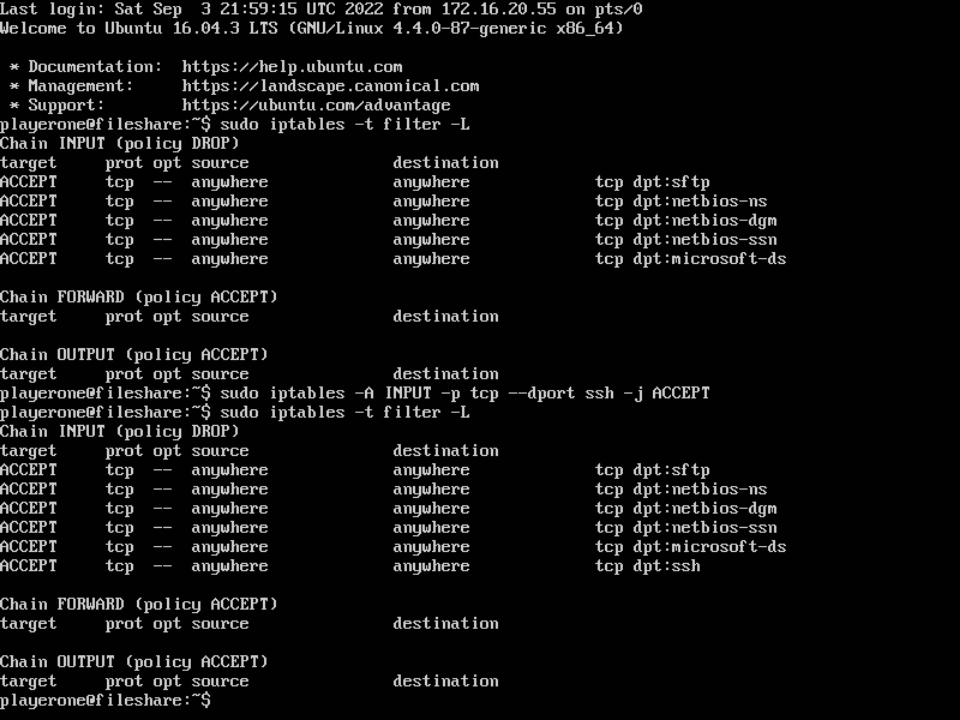

# Challenge 16 (T0438) - Foolish Firewall Configurations

## Challenge Info
**Author:** Mike Korcha 
**Framework Category:** Protect and Defend 
**Specialty Area:** Cybersecurity Defense Infrastructure Support 
**Work Role:** Cyber Defense Infrastructure Support Specialist 
**Task Description:** Create, edit, and manage network access control lists on specialized cyber defense systems (e.g., firewalls and intrusion prevention systems).

### Scenario
An intern of ours installed a new core firewall about a month ago. A recent network security audit has shown that, while being installed, the new firewall was not properly configured. Additionally, three of our server’s host firewalls have not been configured to filter inbound traffic properly. You are tasked with configuring the firewalls on each ill-configured host as well as the core firewall to reject all but necessary traffic.

### Additional Information
More details and objectives about this challenge will be introduced during the challenge meeting, which will start once you begin deploying the challenge.

You will be able to check your progress during this challenge using the check panel within the workspace once the challenge is deployed. The checks within the check panel report on the state of some or all of the required tasks within the challenge.

Once you have completed the requested tasks, you will need to document the methodology you used with as much detail and professionalism as necessary. This should be done on the documentation tab within the workspace once the challenge is deployed. Below the main documentation section be sure to include a tagged list of applications you used to complete the challenge.

Your username/password to access all virtual machines and services within the workspace will be the following... 
Username: `playerone` 
Password: `password123`

The username/password used to access the Firewall's web interface within the workspace will be the following... 
Username: `admin` 
Password: `password123`

## Meeting Notes

## Network Map

## Documentation
### Network firewall only allows external HTTP and HTTPS traffic to Prod-Joomla
I have previous experience updating firewall rules on pfSense and OPNsense boxes, so meeting this challenge was relatively easy. I modified the firewall rules to only allow HTTP/S traffic to the firewall's WAN interface, and then I applied port forwarding rules to re-direct web traffic to the `Prod-Joomla` server. 

### Prod-Joomla only has HTTP HTTPS and SSH available via host firewall
While I have heard of *iptables* before, I have never actually worked with the program--so this was my first time cutting my teeth on it. My previous experience and knowledge with firewall rules served me well, and with a little bit of Google-ing, I was able to craft the necessary rules to restrict ingress traffic to only SSH and HTTP/S.

### Database only has MySQL available via host firewall
I tried applying the configuration restrictions via SSHing into the database server (and then using `powershell.exe`), but the server didn't respond very well. I opted instead to RDP into the server and applied the firewall rules via the GUI.

### Fileshare only has SFTP and Samba available via host firewall
I accidentally locked myself out of my SSH session when attempting to configure the rules for the fileshare server; I mistakenly though that allowing SFTP would also allow SSH, but that wasn't the case. I had to RDP into the fileshare box to add in an allow rule for SSH.

## NICE Framework & CAE KU Mapping

### NICE Framework KSA
- K0001. Knowledge of computer networking concepts and protocols, and network security methodologies.
- K0004. Knowledge of cybersecurity and privacy principles.
- K0005. Knowledge of cyber threats and vulnerabilities.
- K0033. Knowledge of host/network access control mechanisms (e.g., access control list, capabilities lists).
- K0044. Knowledge of cybersecurity and privacy principles and organizational requirements (relevant to confidentiality, integrity, availability, authentication, non-repudiation).
- K0221. Knowledge of OSI model and underlying network protocols (e.g., TCP/IP).
- K0332. Knowledge of network protocols such as TCP/IP, Dynamic Host Configuration, Domain Name System (DNS), and directory services.
- S0007. Skill in applying host/network access controls (e.g., access control list).
- S0121. Skill in system, network, and OS hardening techniques. (e.g., remove unnecessary services, password policies, network segmentation, enable logging, least privilege, etc.).

### CAE Knowledge Units
- Cybersecurity Foundations
- Cybersecurity Principles
- Network Defense
- Network Security Administration
- Operating Systems Administration
- Operating Systems Concepts
