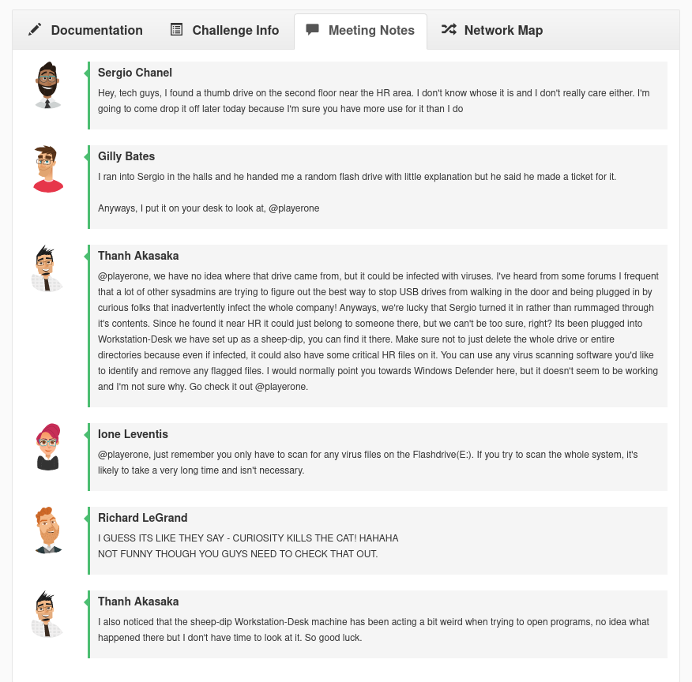
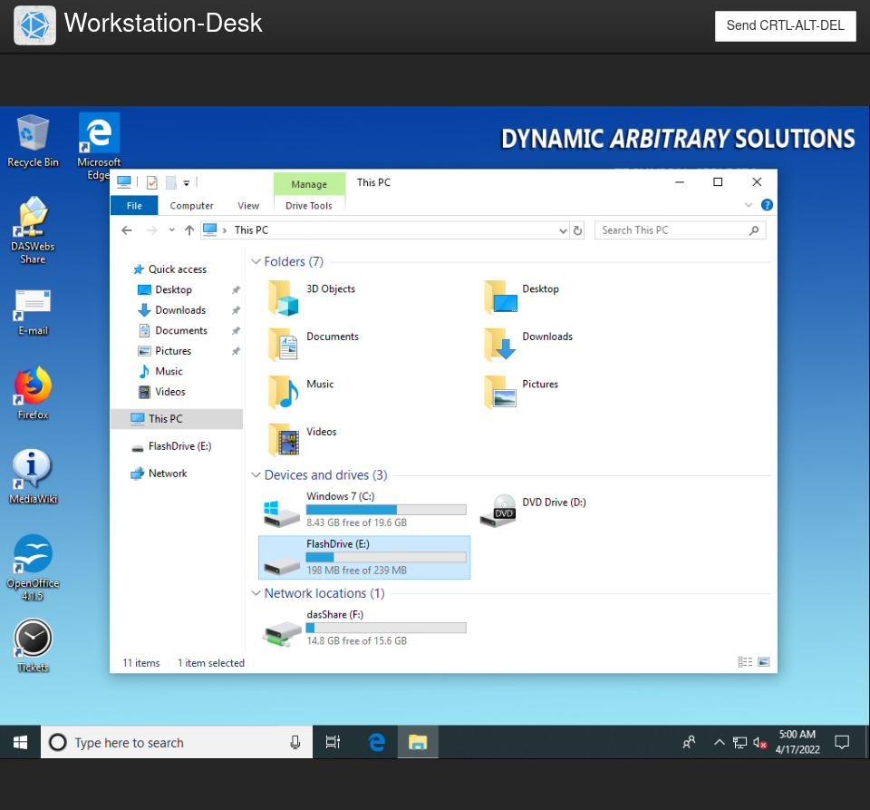
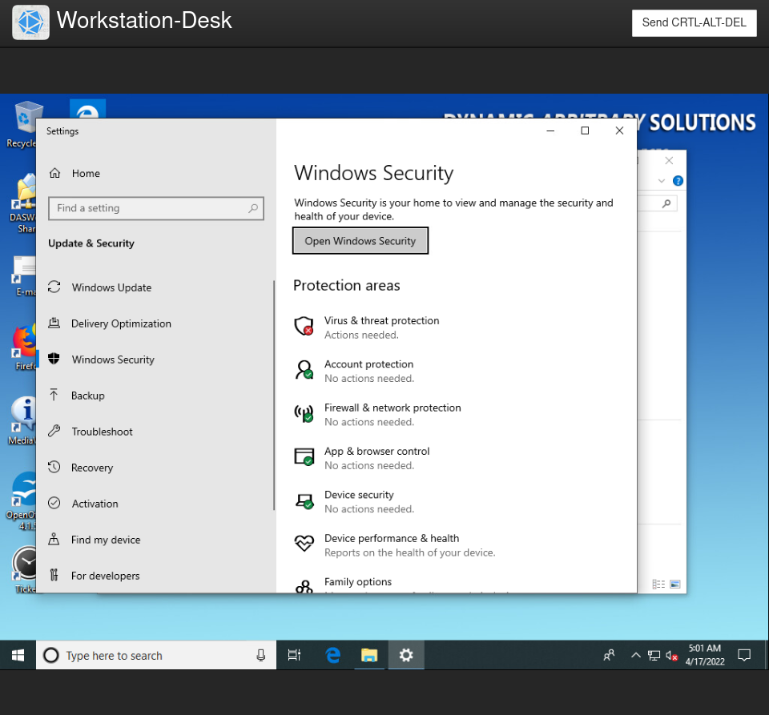
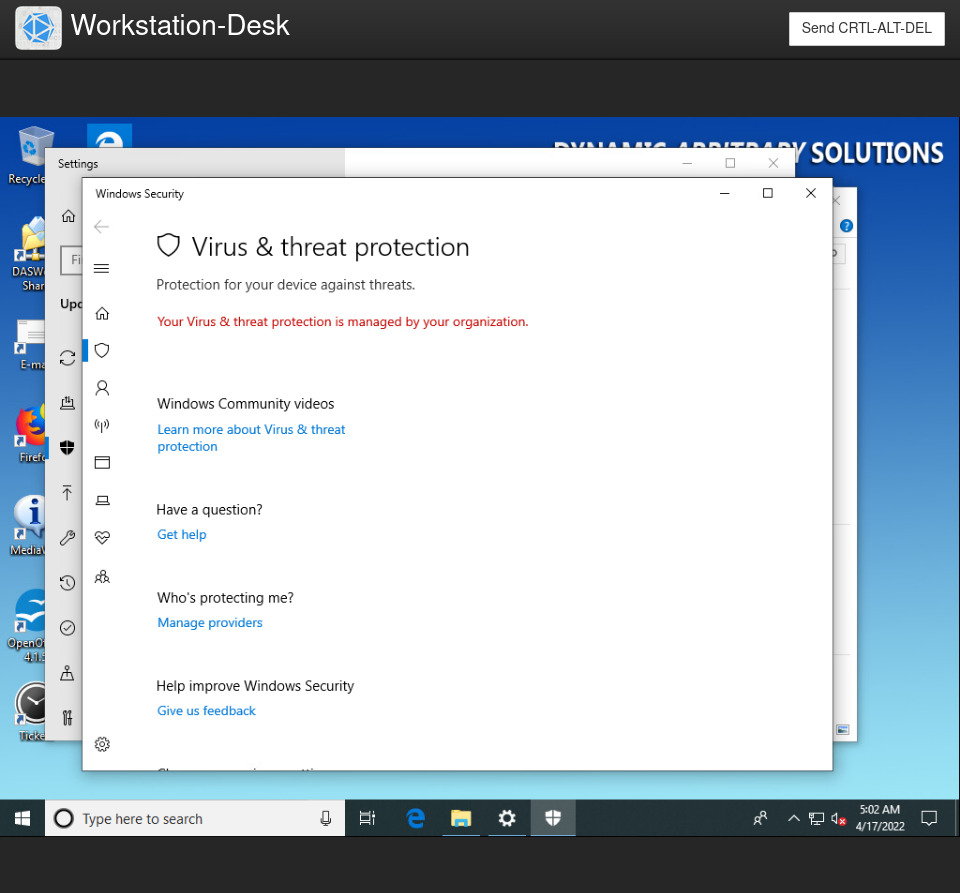
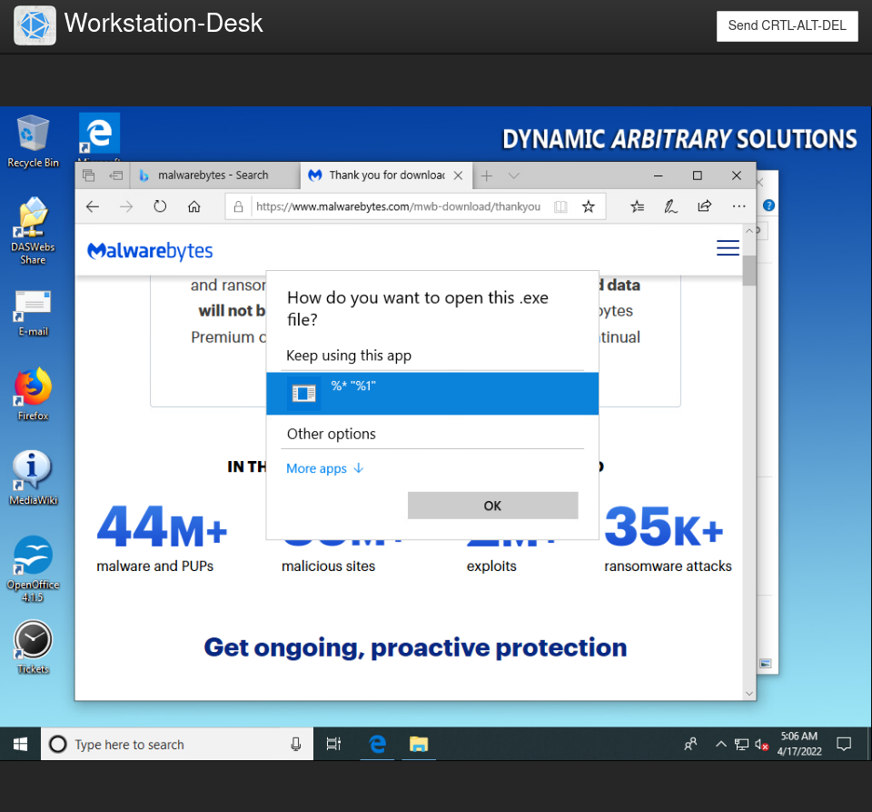
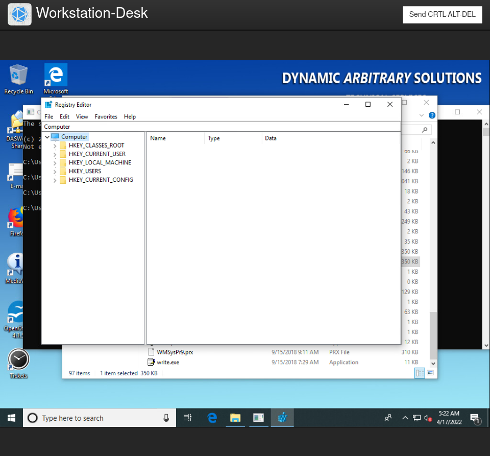
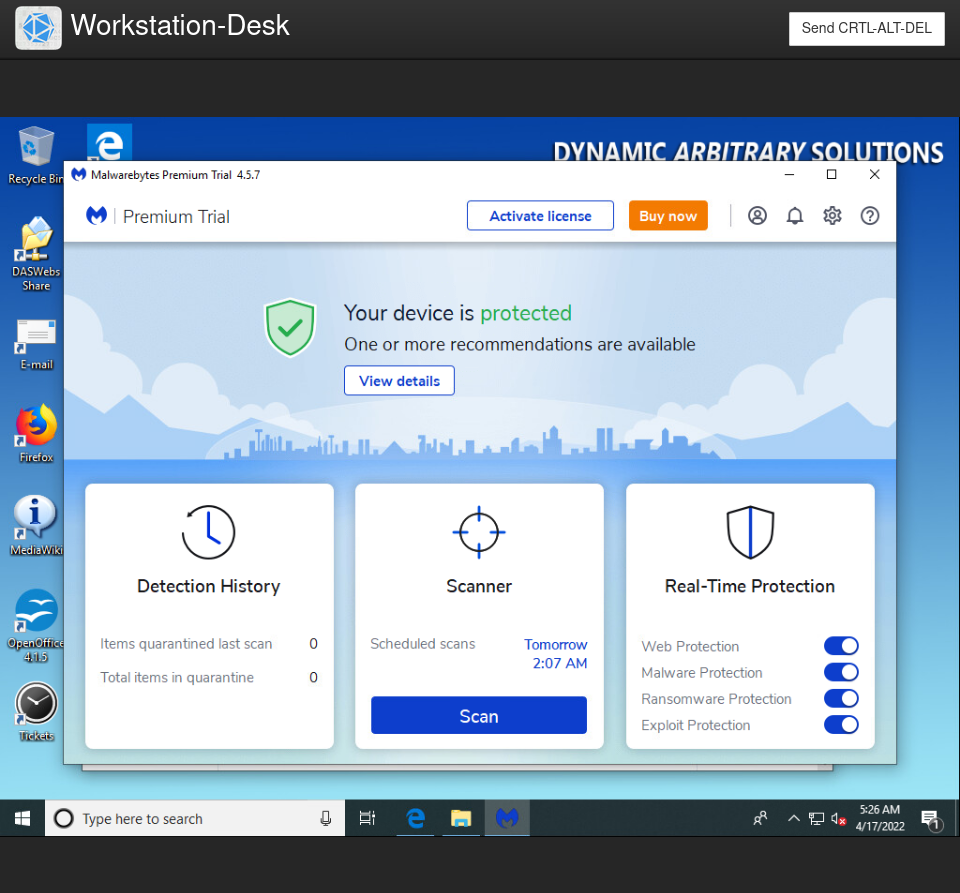
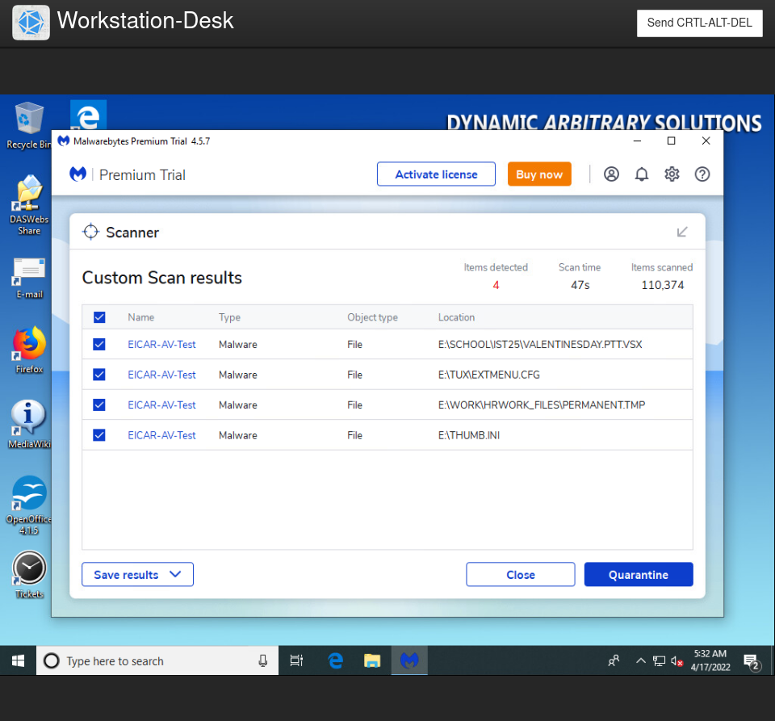
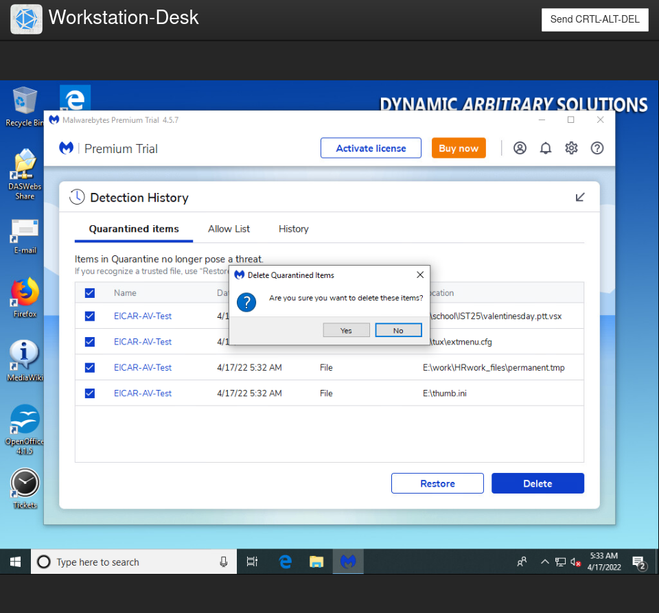

# Special Study (#T0285) - Disappearing Drives Complexity

## Challenge Info
**Author:** Brendan Higgins 
**Framework Category:** Investigate 
**Specialty Area:** Digital Forensics 
**Work Role:** Law Enforcement/Counter-Intelligence Forenics 
**Task Description:** Perform virus scanning on digital media.

### Scenario
A SUB thumb drive of unknown origin or owner has been found in the office. I need you to check and verify that the thumb drive does not contain any malicious software that could infect and damage the company's valuable data.

### Additional Information
More details and objectives about this challenge will be introduced during the challenge meeting, which will start once you begin deploying the challenge.

You will be able to check your progress during this challenge using the check panel within the workspace once the challenge is deployed. The checks within the check panel report on the state of some or all of the required tasks within the challenge.

Once you have completed the requested tasks, you will need to document the methodology you used with as much detail and professionalism as necessary. This should be done on the documentation tab within the workspace once the challenge is deployed. Below the main documentation section be sure to include a tagged list of applications you used to complete the challenge.

Your username/password to access all virtual machines and services within the workspace will be the following... 
**Username:** `playerone` 
**Password:** `password123`

The username/password used to access the Firewall's web interface within the workspace will be the following... 
**Username:** `admin` 
**Password:** `password123`

## Meeting Notes

## Network Map

## Documentation
### 2022-17-04 05:00Z
Upon reviewing the challenge details and meeting notes, I set off to begin my tasks. I logged into the endpoint `Workstation-Desk` and opened File Explorer to briefly view the contents of the thumb drive. There were many files, so manual inspection was definitely not going to be a feasible option.

### 2022-17-04 05:02Z
I tried opening up the Windows Security app to run Windows Defender. The meeting notes indicated that Defender wasn't working, but I wanted to try nonetheless. But the notes did not lie; it seems that running Defender would not be an option.

To pivot, I decided on downloading and installing a third-party anti-malware program--such as Malwarebytes.

### 2022-17-04 05:06Z
I searched for Malwarebytes by using Bing Search and Microsoft Edge. However, I was not able to run the executable. As a matter of fact, I was not able to run a majority of any EXE files on the computer at all.

### 2022-17-04 05:11Z 
Since it seems that I wasn't able to open up any EXE files, I decided to do another search and came across a Microsoft KB article that looked promising as a potential fix to my issue: https://docs.microsoft.com/en-us/troubleshoot/windows-server/deployment/cant-open-exe-files

As a workaround, I was able to run the `regedit.exe` program as an admin directly, and I made the changes detailed in Microsoft's KB article--at steps 6, 7, and 8.

> 6. Navigate to and select the key: `HKEY_CLASSES_ROOT\exefile\shell\open\command`
> 7. In the right pane, double-click the (Default) value.
> 8. Delete the current value data, and then type: `"%1" %*`

### 2022-17-04 05:25Z
After applying the above fix, I was able to install Malwarebytes onto the computer and run a malware scan against the thumb drive.

The scan reported four malicious files, and I successfully completed the challenge by destroying said files.

## NICE Framework & CAE KU Mapping

### NICE Framework KSA
- K0017. Knowledge of concepts and practices of processing digital forensic data.
- K0060. Knowledge of operating systems.
- K0117. Knowledge of file system implementations (e.g., New Technology File System [NTFS], File Allocation Table [FAT], File Extension [EXT]).
- K0132. Knowledge of which system files (e.g., log files, registry files, configuration files) contain relevant information and where to find those system files.
- K0133. Knowledge of types of digital forensics data and how to recognize them.
- K0187. Knowledge of file type abuse by adversaries for anomalous behavior.
- S0067. Skill in identifying, modifying, and manipulating applicable system components within Windows, Unix, or Linux (e.g., passwords, user accounts, files).
- S0073. Skill in using virtual machines. (e.g., Microsoft Hyper-V, VMWare vSphere, Citrix XenDesktop/Server, Amazon Elastic Compute Cloud, etc.).
- S0092. Skill in identifying obfuscation techniques.

### CAE Knowledge Units
- Cybersecurity Foundations
- Cybersecurity Principles
- Cyber Threats
- Intrusion Detection/Prevention Systems
- Operating Systems Concepts
- Vulnerability Analysis