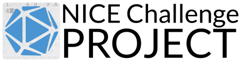

# WriteUps
Archival location for write-ups of various projects—including CTF games, HackTheBox Labs, NICE challenges, and more.

## NICE Challenge

> The [NICE Challenge Project](https://nice-challenge.com/) develops real-world cybersecurity challenges within virtualized business environments that bring students the workforce experience before the workforce. Our goal is to provide the most realistic experiences to students, at-scale year-round, while also generating useful assessment data about their knowledge, skills, and abilities for educators.